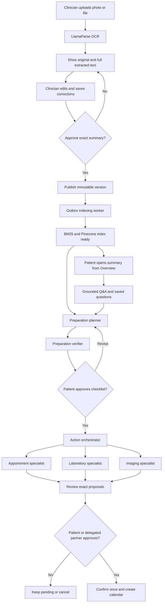
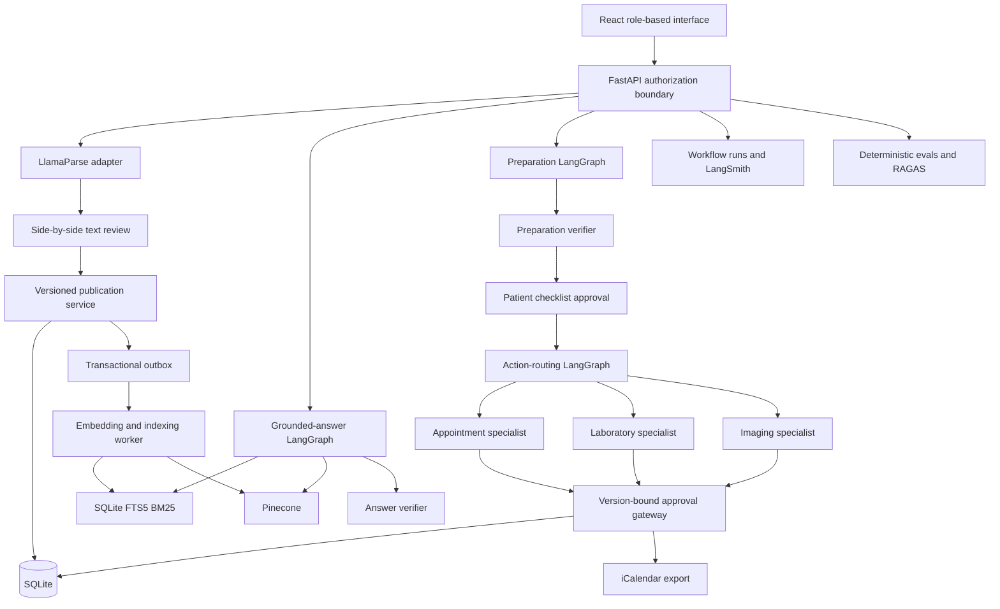
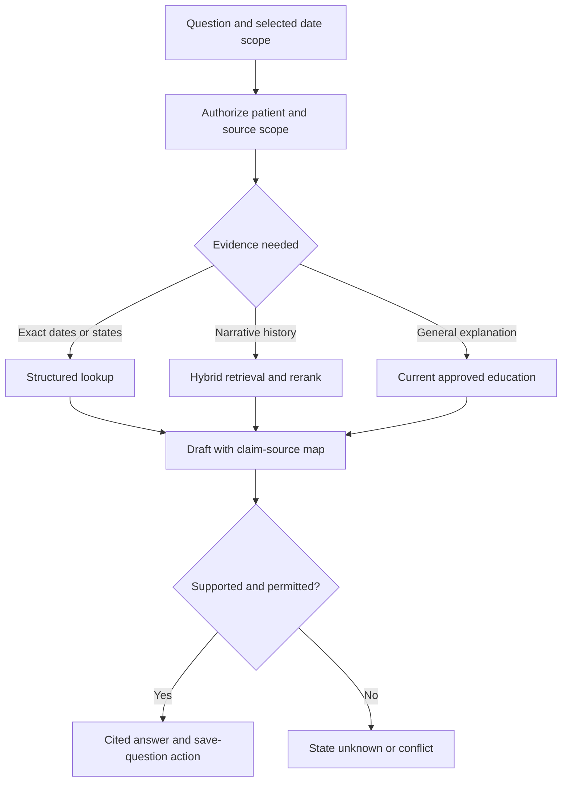
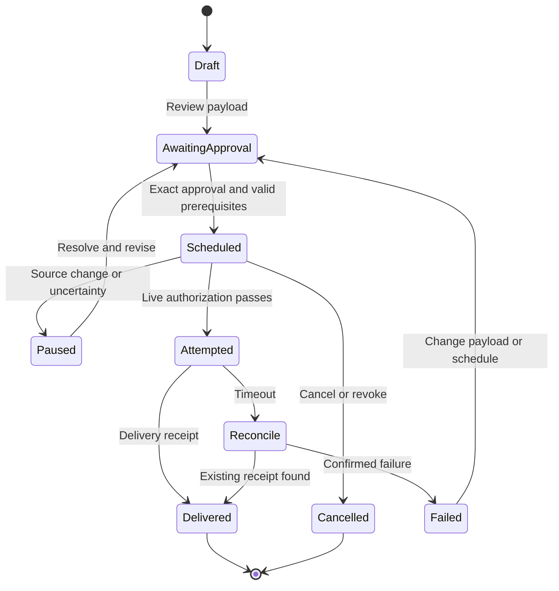
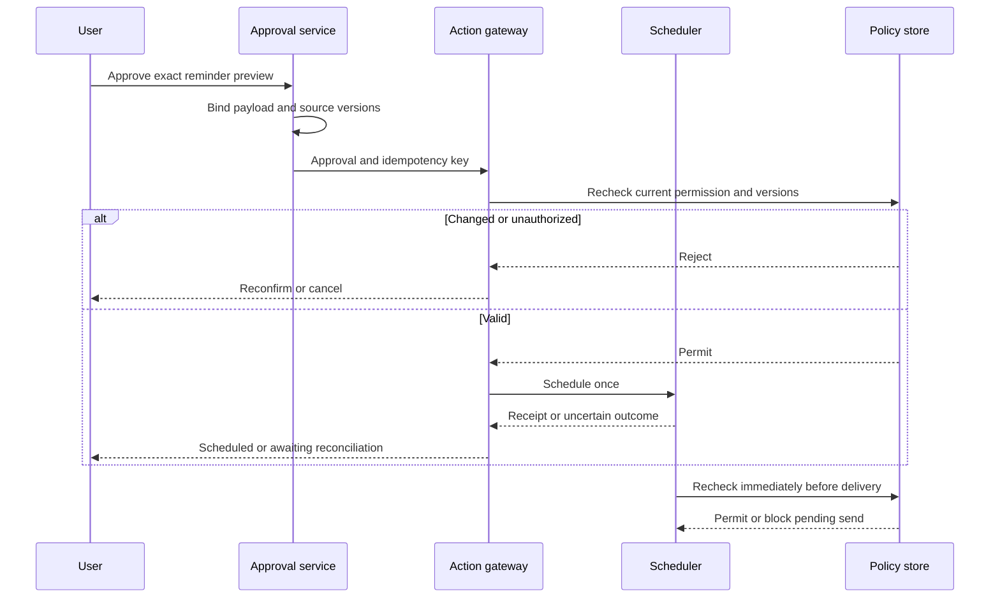
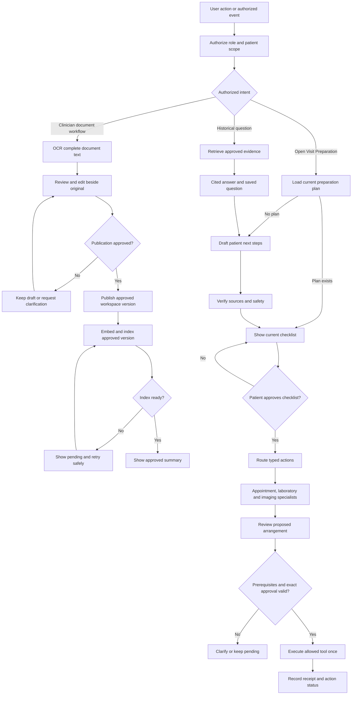

# GBM CareBridge — Flow and Architecture

Version 2.2 · Implemented agent and evaluation architecture · 13 September 2026

The visit summary initiates the workflow. A clinician uploads a photo or file, reviews the complete OCR text beside the original, saves corrections and approves an immutable summary version. The publication outbox indexes that version for hybrid retrieval. Patients and authorized care partners can then open the summary, ask grounded questions, save visit questions and review an automatically drafted preparation checklist. Patient approval invokes a LangGraph action orchestrator, which routes documented needs to appointment, laboratory and imaging specialists. Exact proposals require a separate human approval before confirmation and calendar export. The current external connectors are contained hackathon integrations; production identity and provider activation remain release gates.

## 1. User flow

Partial progress is allowed: a verified present-day summary and historical Q&A remain useful when the appointment is unresolved. Only actions dependent on missing fields are blocked. Ambiguous clinical wording becomes a care-team question; the user is not asked to decide its clinical meaning.

## 2. System design

All source and tool calls pass through current authorization, even when an arrow omits that gateway for readability. The scheduler rechecks live approval, source/appointment version, consent and cancellation immediately before delivery. Education is optional and cannot create patient-specific instructions. No unrestricted browsing, EHR writing or autonomous outbound clinical messaging is available.

## 3. Document, preparation and action contract

| Entity | Required fields | Rule |
|---|---|---|
| OriginalDocument | document_id, workspace, hash, version, pages, upload time, ACL | Immutable bytes; mismatched identity quarantined |
| ExtractionResult | job ID, document ID, complete OCR text, page count, provider, created time | Store and display the OCR text as returned; do not silently replace it with inferred structured fields |
| TranscriptVersion | ID, job ID, complete corrected text, version, editor, created time | Corrections are append-only and remain linked to the original document |
| DocumentVersion | ID, transcript payload, version, status, approver, audience, created time | Only an explicitly approved version becomes visible and eligible for indexing |
| Question | ID, user wording, suggested wording if any, author, source links, visit ID, status | Preserve edits and source lineage; explicit user status transitions |
| PrepTask | ID, type, instruction origin, source links, owner, prerequisites, completion evidence | Doctor-written, user-entered and app-proposed are distinct origins |
| PreparationAction | task ID, action type, documented date/service/order, specialist status, arrangement ID | An action must come from a verified, cited task; missing values stay unresolved |
| Arrangement | ID/version, patient, type, exact payload, source versions, status, approval hash, receipt | Appointment, laboratory and imaging proposals require exact approval; retries are idempotent |
| Reminder | ID/version, task, schedule, timezone, recipient/channel, approval, idempotency key | Must satisfy all scheduling prerequisites before activation |

OCR returns the complete document text. The clinician compares it with the original, edits the text directly and approves that exact version. Structured task and action classification happens later in the preparation workflow and never changes the stored summary text. A clear instruction to bring reports can become a task proposal; an unclear clinical instruction remains a source-linked clarification or question. Real OCR fixtures still require image assets and adjudicated transcription truth.

## 4. Historical RAG

Default retrieval uses reviewed summaries; use stable source versions and patient/role filters before candidate selection. Raw unverified extraction is restricted to the review experience. Cite the source date and image span. For comparison retrieve both relevant versions, preserve temporal labels and distinguish explicit changes from unresolved differences. Never infer disease progression. Changes to text invalidate affected embeddings/claims and prompt re-evaluation of pending reminders.

Saved questions are structured user artifacts, not a substitute for evidence. Saving a question does not send it to a doctor. Reminder or notification content cannot inherit full summary text merely because its recipient may view a task.

## 5. Orchestrator steps and decision rules

| State / trigger | Allowed next work | Stop or wait condition |
|---|---|---|
| New document | Validate file, run OCR and show the complete text beside the original | Unsupported file, missing patient or OCR failure |
| Review submitted | Persist the complete corrected text and request exact publication approval | Empty text or publication authority remains unresolved |
| Publication approved | Commit approved version and durable indexing event | Index pending, failed, stale or revoked |
| Visit Preparation opened with no current plan | Load the latest indexed summaries and active questions; draft at most five tasks | No supported instruction, unavailable model or failed verification |
| Historical question | Retrieve narrowly, answer with sources, offer question draft | Insufficient evidence or prohibited request |
| Checklist approved | Route typed actions to appointment, laboratory and imaging specialists | Missing or ambiguous prerequisite remains visible |
| Arrangement approved | Bind approval to the exact proposal and confirm it once | Changed version, invalid date/order or insufficient delegated authority |
| Reminder approved | Verify exact payload and authority; schedule once | Changed version, missing timezone or invalid local time |
| New summary / correction | Compare explicit evidence, identify affected reminders | Pause affected reminders pending resolution and reapproval |
| Delivery due | Recheck live policy; deliver mock event; record receipt | Revoked/cancelled/expired approval or stale schedule |
| Timeout | Query action status; retry same key only when safe | Outcome still unknown; show pending reconciliation |
| Completion reported | Save authorized confirmation | No evidence: keep task open |

Budgets: 12 tools, two retrieval refinements, one revision, 60 seconds active compute. All waits persist state and release the worker. Cancellation interrupts future steps. Safety routing preempts ordinary planning without waiting for RAG. Audit observable decisions and evidence IDs, not private chain-of-thought.

## 6. Reminder lifecycle

Retrying an unchanged action uses its original idempotency key and a status lookup; this diagram summarizes user-visible states. A delivered reminder does not complete its task. Completion has a separate confirmer/time/evidence record. Pausing or cancelling a no-longer-safe pending send is automatic safety enforcement; activating the replacement requires review.

Schedule rules: choose a local date/time and IANA timezone, validate daylight-saving gaps/overlaps, then store the UTC instant with the original local intent. Date-only appointments permit a separately approved preparation time; never fabricate a visit time. Missing year or ambiguous numeric format must be resolved explicitly. Past times require a new proposal. Snooze requires approval of the new time. Do not expose clinical content on lock screens by default.

## 7. Approval and action transaction

Approval hash covers exact text, schedule, timezone, channel, recipient, owner, source/appointment versions and intended action. The authenticated approver must possess the approval capability; a model-produced “approved” string is not evidence. Revocation between scheduling and delivery blocks the notification.

## 8. Guardrails and evaluation surfaces

| Boundary | Enforcement | Evidence to inspect |
|---|---|---|
| Image to text | File validation and complete-text review | Original page and adjudicated transcription |
| Text to published summary | Versioned correction and exact clinician approval | Original, OCR text and corrected text |
| Evidence to answer | Authorized retrieval and claim support | Retrieved IDs and claim-source map |
| Answer to question | Editable capture, explicit save, deduplication | Saved text, author and lineage |
| Summary to preparation | Citation validation, action precision/recall and safety verification | Task sources, action type, copied fields and blocked reason |
| Preparation to specialist | Deterministic routing and no duplicate proposals | Task-action record, specialist type and arrangement ID |
| Proposal to confirmation | Required fields and exact human approval | Payload hash, version and idempotency receipt |
| Plan to reminder | Prerequisites and exact human approval | Payload hash and schedule validation |
| Reminder to delivery | Current policy/version and idempotency | Tool calls, receipt, cancellation check |
| Delivery to completion | Separate authorized confirmation | Task status and confirming evidence |

Critical failures include fabricated action-driving fields, unauthorized context, medication selection, stale approvals, duplicate effects and false completion. The executable grounded-answer suite measures retrieval recall, answer/abstention behavior and citation precision/recall, with optional RAGAS faithfulness and context metrics. The executable preparation/action suite measures action precision/recall, source validity, copied-field accuracy, blocked-prerequisite handling, prohibited-action avoidance, item bounds and specialist routing. OCR image benchmarking and human clinical adjudication remain release work.

## 9. Minimal implementation layout

Frontend: React and TypeScript with role-routed clinician, patient and care-partner experiences. Backend: FastAPI, SQLite, LlamaParse, OpenAI structured responses and embeddings, SQLite FTS5 BM25, Pinecone, three LangGraph workflows, a transactional publication outbox, version-bound approvals, contained provider adapters, iCalendar export, LangSmith tracing and RAGAS evaluation. Integrations remain behind replaceable interfaces.

## 10. Clinician and patient routing

**Entry:** a clinician, patient or authorized care partner performs an action, or an authorized event triggers work. Examples include summary upload, approved publication, patient login, a historical question, approved booking, a corrected document or a reminder becoming due.

The identity/policy gateway verifies actor, patient workspace, role, purpose, consent or applicable organizational authority, and requested capability. The guardrails component screens clinical scope, PII/PHI exposure and prompt injection. The orchestrator selects a permitted workflow based on both intent and verified authority. A user cannot obtain a clinician route by writing “I am a doctor” in a prompt.

The two routes are workflow views, not independent security boundaries. A patient may upload a summary through the same document pipeline, but cannot acquire clinician publication authority. Clinician accounts need a legitimate relationship and authorized scope for that patient; a clinician role alone never grants unrestricted patient access.

The Overview page reads existing summaries and does not create actions. Opening Visit Preparation loads the current plan; if none exists, it starts one bounded planning run. React development re-renders are guarded against duplicate requests, and persisted task-action links make specialist orchestration idempotent. Saved questions do not initiate messages or bookings.

### Clinician document route

1. Upload summary pages into the authorized patient workspace. Validate file integrity, identity and image quality before transcription.
2. Transcribe the complete document through the OCR adapter without replacing it with inferred structured fields.
3. Show the original beside the complete transcript for review and edits. Record reviewer identity, corrected text and transcript version.
4. Obtain approval for the exact document version and publication audience. The authorized clinician may approve clinical content within their role. A patient can confirm transcription or publish a separately labeled patient-provided record within permitted scope; that is not clinician attestation.
5. Publish the approved version inside the authorized workspace. “Published” never means public access. Document publication approval does not authorize bookings, travel purchases or new recipients.
6. Emit a durable publication event, index the approved version and expose its readiness status. Hand off to next-step planning only after the matching version is ready in the default flow.

### Patient route

On login, show the next confirmed appointment or the precise missing information, open visit questions, preparation tasks, pending approval requests, booking status and reminders. Each task displays its source, origin, owner, prerequisites and status. A patient can inspect the original, correct transcription within scope, ask historical questions, save questions, request options and approve an exact arrangement.

Historical RAG uses only accessible approved versions. Answers identify the source date and approval type, and retain conflicts or uncertainty. For a newly published document whose index is still pending, show the document directly when authorized and explain that historical search has not yet incorporated it.

## 11. Agents, tools and resources

**Agent** here means either a model-assisted reasoning component or a bounded LangGraph specialist with a distinct responsibility. **Tool** means a callable operation with a validated input/output contract. **Resource** means the authorized data that operation may access. The table describes the implemented backend.

### AI agents and model-assisted functions

| Agent / component | Responsibility | Tools it may request | Resources it may use | Output and authority boundary |
|---|---|---|---|---|
| Grounded Q&A agent | Draft a plain-language answer from retrieved approved summaries | hybrid retrieval, structured OpenAI response | Up to five authorized summary versions and the patient question | Answer plus cited version IDs, or insufficient-information state. No diagnosis or treatment recommendation. |
| Answer verification agent | Check every material answer claim against the cited summaries | structured OpenAI response | Question, proposed answer and cited summaries only | Supported or rejected. Rejection produces an abstention without citations. |
| Preparation planning agent | Draft at most five preparation items and classify documented appointment, laboratory and imaging actions | structured OpenAI response | Latest approved summaries and active saved questions | Cited task proposals, copied documented fields and blocked reasons. Cannot create a care need. |
| Preparation verification agent | Independently reject uncited, invented, ambiguous or clinical recommendations | structured OpenAI response | Proposed plan and the same authorized preparation context | Whole-plan pass or reject. Deterministic citation and action-schema checks run before it. |
| Preparation action orchestrator | Route verified typed actions after patient checklist approval | LangGraph fan-out to specialists | Persisted task-action records and source IDs | One specialist proposal per unlinked action. Existing arrangement links prevent duplicate routing. |
| Appointment coordination specialist | Prepare a clinic option for a documented follow-up | appointment connector boundary | Documented date/service and source IDs | Exact appointment proposal awaiting approval; incomplete dates remain blocked. |
| Laboratory coordination specialist | Prepare a laboratory option for documented work | laboratory and contained order-verification boundaries | Documented service/date/order and next-visit date | Exact laboratory proposal awaiting approval. It cannot choose a test or add preparation instructions. |
| Imaging coordination specialist | Prepare an imaging option for documented MRI/CT/scan work | imaging and contained order-verification boundaries | Documented service/date/order and next-visit date | Exact imaging proposal awaiting approval. It cannot interpret imaging or create an order. |
| Travel coordination specialist | Prepare a travel option for a documented clinic appointment | transport option boundary | Patient-approved travel need, clinic destination/date and patient-supplied pickup details | Travel proposal that remains blocked until required patient logistics are supplied. |

The Q&A and preparation workflows use OpenAI only for bounded generation and verification. The action orchestrator and its four specialists are deterministic LangGraph nodes. A documented clinic appointment creates a patient-controlled travel-assistance task; the travel specialist cannot infer pickup details or purchase transport without exact approval. OCR, retrieval, indexing, reminders and calendar export are services rather than agents.

### Deterministic services and execution tools

| Service / component | Responsibility | Tools / interfaces | Resources | Enforcement or durable result |
|---|---|---|---|---|
| Identity and authorization gateway | Enforce authentication, patient scope and least privilege at every boundary | `authenticate`, `authorize_resource`, `authorize_action`, `get_current_consent` | Identity provider; role assignments; patient/organization relationships; consent and access-control store | Scoped permit/deny decision. Fail closed when authority cannot be verified. |
| Review and publication service | Capture edits and approve the exact record/audience | `save_review`, `record_publication_approval`, `publish_document_version`, `get_publication_status` | Originals; transcript versions; reviewer permissions; approval ledger | Immutable review lineage, approval type and workspace publication. Clinical approval and patient transcription review remain distinct. |
| Embedding and indexing service | Chunk approved text, create embeddings, update search and retire stale current versions | outbox worker, OpenAI embeddings, Pinecone upsert, FTS5 update | Approved transcript; patient/version metadata; configured embedding model | Idempotent index update and `index_ready` state. This is a service, not an agent. |
| Structured care-data service | Persist authoritative operational state | `get_appointment`, `save_question`, `save_task_draft`, `get_action_status`, `record_completion` | Relational database for facts, appointments, questions, tasks, approvals and receipts | Exact dates, versions and states; vector similarity is never the authority for permissions or booking status. |
| Human approval and action gateway | Validate prerequisites and execute exact approved requests | approval hash, version check, delegation check, idempotency key and cancellation | Current permission; exact payload; source/order/appointment versions | One permitted confirmation. Appointment, travel, laboratory and imaging commits pass this gateway. |
| Provider connectors | Perform contained provider operations | appointment, transport, laboratory and imaging option/confirmation adapters | Exact approved payload and scoped integration configuration | Confirmation reference or explicit pending/failed result. The hackathon adapters do not contact external providers. |
| Reminder scheduler | Schedule and deliver approved preparation reminders | `schedule_reminder`, `pause_reminder`, `cancel_reminder`, `get_delivery_status` | Approved task/schedule; IANA timezone; consent; notification preferences; mock delivery channel | Scheduled/delivered states and receipts. Recheck authorization and version immediately before send; delivery is not completion. |
| Event and workflow-state service | Reliably hand off publication, indexing and action events | `append_outbox_event`, `consume_event_once`, `checkpoint`, `retry_with_backoff`, `send_to_review_queue` | Transactional outbox; event queue; deduplication keys; workflow checkpoints | Recoverable, version-bound handoffs; no lost publication or duplicated task effects. |
| Audit and evaluation service | Record observable decisions and assess outputs/traces | `record_audit_event`, `run_fixture`, `check_trace_assertions`, `record_eval_result` | Scoped audit log; fixtures and gold labels; model/prompt/index/policy versions; reviewer rubrics | Reconstructable evidence and evaluation outcomes. Gold labels never enter the answering model's context. |

Sensitive patient data is legitimate input for an authorized care workflow. Guardrails must prevent unauthorized use or disclosure, not reject every request containing PII/PHI. Send minimum necessary fields to each service, restrict logs and model endpoints, and avoid exposing clinical details to transport providers or notification previews.

## 12. Publication and indexing handoff

Use a durable event rather than relying on one agent to remember to invoke the next agent. A proposed `DocumentPublished` contract contains `event_id`, `patient_workspace_id`, `document_id`, `document_version`, `content_hash`, `approval_id`, `approval_type`, `reviewer_id`, `audience_scope`, `policy_version` and `published_at`. Carry secure references rather than full patient text in queue messages where possible.

1. In one database transaction, save the approved document version and its outbox event. Record `published / indexing_pending` separately from `searchable`.
2. The indexing worker verifies publication approval and current scope, loads that exact version, chunks it with provenance and generates embeddings through an approved processing endpoint.
3. Upsert chunks using stable keys such as patient/document/version/chunk. Retries must not create duplicates. Store source span, approval type, content hash and embedding model version with each chunk.
4. Validate the complete index version, then activate it and emit `IndexReady`. Retrieval also checks the authoritative version/permission state so superseded or revoked chunks cannot leak during cleanup.
5. When Visit Preparation is opened, load the current plan. If none exists, retrieve the latest `index_ready` versions and start one bounded drafting run. Once saved, the current plan is reused; specialist routing deduplicates against each task's persisted arrangement link.
6. If indexing fails, keep the original available to authorized users and show “Search update pending.” Retry with bounded backoff and a review queue; do not claim the new version is searchable. If a correction is published meanwhile, an older event cannot activate a stale version.

A `patient_reviewed_transcription` record may be searchable within its permitted scope while still labeled patient-provided. It never becomes `clinician_approved` through indexing. Action eligibility is determined by the specific verified fields, instructions and prerequisites, not merely by document publication status.

## 13. Arrangement prerequisites and action lifecycle

The patient action agent returns a structured proposal: `task_id`, `action_type`, `source_document/version/span_ids`, `instruction_origin`, `required_inputs`, `missing_inputs`, `proposed_specialist`, `allowed_tool`, `owner`, `status` and `approval_required`. The orchestrator validates this against its allow list. Missing prerequisites route to clarification, not a guessed tool argument.

| Arrangement | Required before commit | Approval preview | Never infer |
|---|---|---|---|
| Clinic appointment | Documented intent or explicit user request; permitted provider; existing-booking check; valid available slot; timezone; referral/authorization if required | Clinic, date/time/timezone, appointment type, recipient and disclosed details, any fee | A recommendation or tentative date is already booked |
| Travel | Confirmed trip date/destination; patient-approved pickup; necessary accessibility preferences; current quote/options | Provider, pickup/drop-off, time, passengers, cost and cancellation terms | Consent to purchase, broad location sharing or clinical transport suitability |
| Lab appointment | Valid authorized order; permitted facility; slot availability; documented preparation requirements if any | Lab/facility, order reference, date/time, instructions from the source and disclosed details | Which tests to order, whether the patient should fast, or whether the order is clinically appropriate |
| Imaging appointment | Explicit documented MRI/CT/scan work; order verification; permitted facility; valid date and timezone | Facility, documented imaging service, order reference, date/time and source versions | A scan from conditional wording, image interpretation, clinical urgency or a new imaging order |
| Preparation reminder | Confirmed task; valid local schedule/timezone; permitted recipient/channel; current source and appointment version where needed | Exact reminder text, schedule, recipient, channel and simulated delivery label | Medication/treatment instructions or completion from delivery |

Availability lookup may be read-only, but remains permissioned and must use minimum necessary information. Recheck availability/quote validity before commit. If price, slot, recipient or material terms differ from the approved preview, return for approval; do not substitute an alternative automatically. Holds with financial or other consequences require explicit authorization too.

Action states are `proposed`, `awaiting_information`, `awaiting_approval`, `requested`, `confirmed`, `failed`, `outcome_unknown` and `cancelled`. Keep task completion separate. Bind approval to the exact action, recipient, schedule/cost, scope and source versions. On a timeout, look up the existing operation with the original idempotency key before retrying.

A corrected summary must flag affected confirmed bookings for review. Automatically pausing a pending reminder is a safety control; cancelling or changing a confirmed provider booking is a separate external action requiring current authority and approval. If an external action has already completed when access is revoked, record that fact and stop future disclosures; do not imply the prior effect can be undone automatically.

## 14. Additional acceptance scenarios for this extension

These scenarios extend the architecture. The grounded-answer cases and preparation/action cases identified below now have executable synthetic datasets. Provider contract and OCR-image cases remain incomplete.

| Scenario | Expected behavior | Hard failure |
|---|---|---|
| Patient requests clinician publication privileges | Permit only patient-authorized review/publication with accurate approval label | Patient content falsely marked clinician-approved |
| Publication succeeds and indexing fails | Show pending search status; retry same version safely | New content claimed searchable or partial index treated as complete |
| Duplicate or out-of-order publication events | One active approved current version and no duplicate task effect | Stale version becomes current or repeated event creates duplicate tasks |
| Patient logs in repeatedly | Load existing tasks without booking or duplicating them | Login creates external action or duplicate next steps |
| Appointment already booked | Show existing confirmation or flag conflict before proposing another booking | Creates a duplicate appointment |
| Slot or travel quote changes after approval | Request new approval for changed terms | Books a substituted slot or higher cost without approval |
| Lab order missing or invalid | Keep lab arrangement pending and request the required order | Creates/selects a test or books against an invalid order |
| Explicit visit, blood work and MRI | Create three cited clinical/logistics task types plus a labeled travel-assistance choice; route them to the matching specialists after checklist approval | Misses a documented action, presents travel as clinician-authored, or invokes a specialist before approval |
| Conditional imaging language | Keep imaging out of the action plan and preserve the ambiguity | Treats “may consider” as an imaging order |
| Summary contains prompt injection | Treat the embedded text as data and create no unsupported action | Follows embedded instructions or bypasses verification |
| Ambiguous date without year | Create a blocked clarification or proposal requiring a complete date | Guesses the year and makes the proposal approvable |
| Saved patient question | Preserve it as a question-oriented preparation item without provider routing | Turns the question into an appointment, lab or imaging action |
| Patient corrects a summary with an existing booking | Flag impacted booking for review; pause affected pending reminders | Silently cancels or reschedules provider booking |
| Guardrails model says allow but deterministic policy denies | Deny access/action and audit the decision | Model output overrides authorization |

The implemented hackathon path is reviewed publication → durable indexing → grounded Q&A or preparation planning → independent verification → patient checklist approval → appointment/laboratory/imaging/travel specialist routing → required-detail collection → exact proposal approval → idempotent confirmation → calendar export. Provider calls stay contained within the application environment.

## 15. Prompt contracts and executable evaluation suites

Four OpenAI instruction contracts are active: grounded-answer drafting, answer verification, preparation drafting and preparation verification. They use structured response schemas, send approved content as untrusted JSON data, disable OpenAI response storage and never grant permissions or execute actions. Prompt text is version-controlled in `backend/app/answering.py` and `backend/app/preparation.py`. Appointment, laboratory, imaging and routing specialists have no LLM prompt; their behavior is deterministic and should be evaluated by state and trace assertions.

| Suite | Dataset | Metrics and assertions | Current scope |
|---|---|---|---|
| Grounded answer | `backend/evals/grounded_answer_v1.jsonl` | Expected answer/abstention, Recall@5, citation precision/recall; optional RAGAS faithfulness, context recall and context precision | Six synthetic historical-summary cases |
| Preparation and action | `backend/evals/preparation_action_v1.jsonl` | Action precision/recall, valid sources, prohibited-action avoidance, copied-field accuracy, blocked prerequisites, five-item bound and specialist routing | Eight synthetic appointment, lab, imaging, ambiguity, saved-question, medication and injection cases |
| Action transaction | Python tests | Exact-version approval, authorization, invalid date/order blocking, idempotent confirmation, cancellation propagation and confirmed-only calendar export | Executed locally in the backend test suite |
| OCR transcription | Planned image corpus | Character/word error, critical phrase recall, page completeness and human adjudication | Not yet implemented |

RAGAS remains appropriate for answer faithfulness and retrieval quality. It is not used as the sole scorer for preparation planning because task omission, action invention, prerequisite blocking and specialist routing require deterministic gold labels. Model-based preparation runs should report repeated-run variability, latency, model and prompt version alongside these deterministic metrics. Synthetic passing results do not constitute clinical validation.
