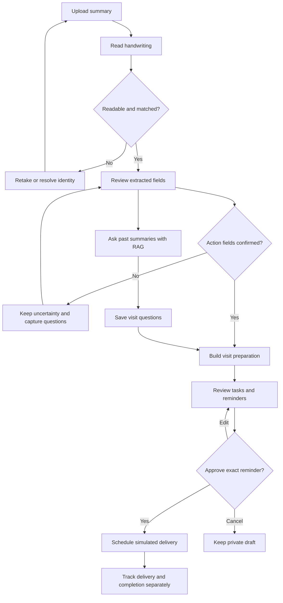
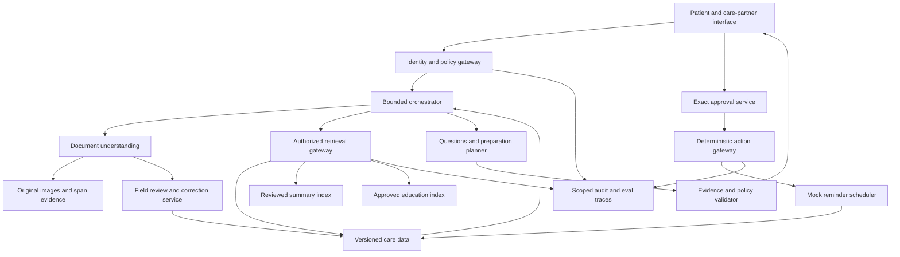
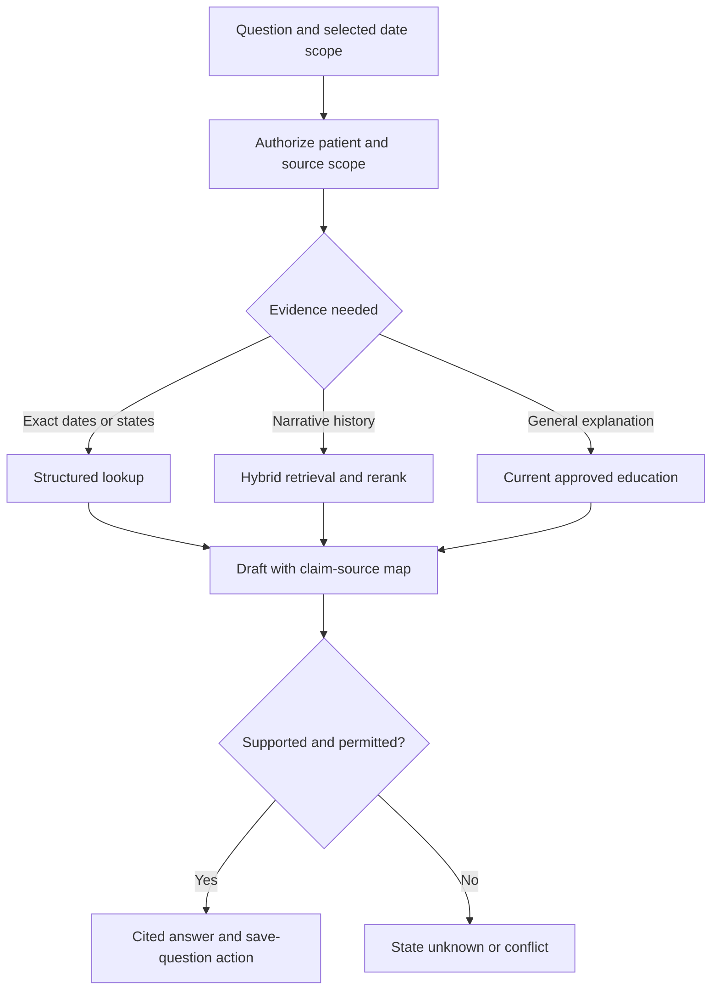
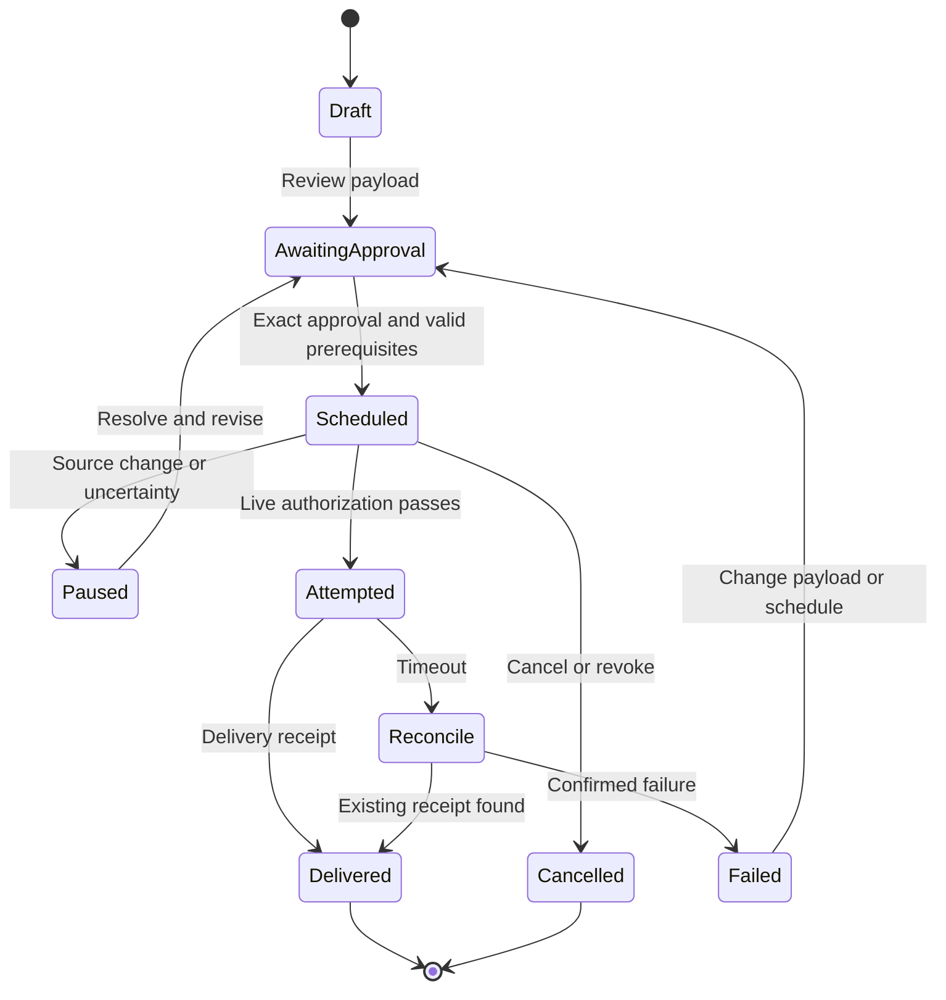
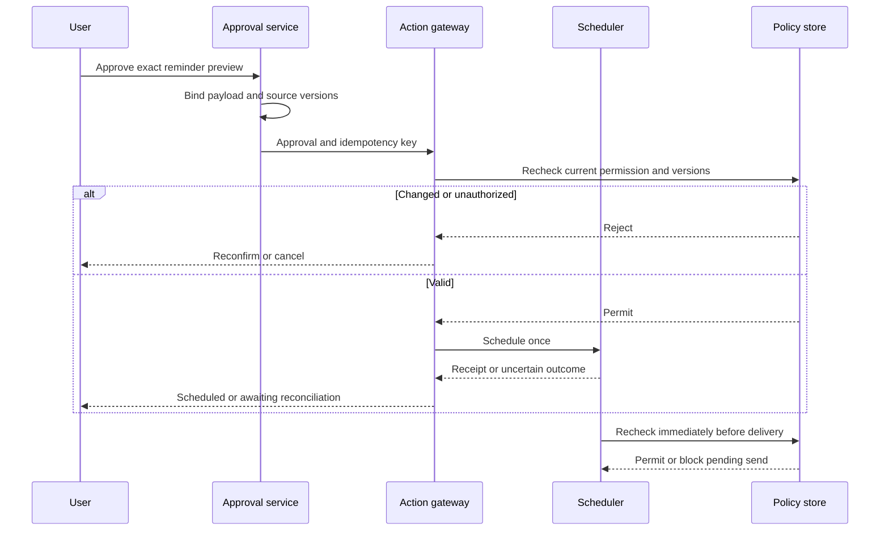

# GBM CareBridge — Flow and Architecture

Version 2.0 · Final hackathon scope · 12 September 2026

The handwritten patient summary initiates the workflow. Original filenames remain for continuity. This architecture supersedes the earlier broad companion design and implements the scope in the v2 PRD. It is a design, not a deployed system.

## 1. User flow

Partial progress is allowed: a verified present-day summary and historical Q&A remain useful when the appointment is unresolved. Only actions dependent on missing fields are blocked. Ambiguous clinical wording becomes a care-team question; the user is not asked to decide its clinical meaning.

## 2. System design

All source and tool calls pass through current authorization, even when an arrow omits that gateway for readability. The scheduler rechecks live approval, source/appointment version, consent and cancellation immediately before delivery. Education is optional and cannot create patient-specific instructions. No unrestricted browsing, EHR writing or autonomous outbound clinical messaging is available.

## 3. Extraction and evidence contract

| Entity | Required fields | Rule |
|---|---|---|
| OriginalDocument | document_id, workspace, hash, version, pages, upload time, ACL | Immutable bytes; mismatched identity quarantined |
| SourceSpan | span_id, document/version, page, bounding_box, raw_text | Coordinates resolve to the original page; missing coordinates are explicitly unknown |
| ExtractedField | field_id, type, raw_text, normalized_value, confidence, span IDs, verification state | Unknown value is null; confidence never equals confirmation |
| FieldReview | reviewer, time, prior value, corrected value, reason, source version | Append-only; user-confirmed transcription is distinct from clinician confirmation |
| Appointment | ID/version, date, optional time/location, provenance, unresolved conflicts | No inferred year/time; current value requires explicit confirmation or supersession |
| Question | ID, user wording, suggested wording if any, author, source links, visit ID, status | Preserve edits and source lineage; explicit user status transitions |
| PrepTask | ID, type, instruction origin, source links, owner, prerequisites, completion evidence | Doctor-written, user-entered and app-proposed are distinct origins |
| Reminder | ID/version, task, schedule, timezone, recipient/channel, approval, idempotency key | Must satisfy all scheduling prerequisites before activation |

Extraction outputs three sections: present-day summary, written recommendations and next appointment. Store raw and normalized values side by side. A clear instruction to bring reports can become a task proposal; an unclear clinical instruction remains a source-linked question. Real OCR fixtures must include image assets and adjudicated region truth; the supplied seeds simulate extraction outputs and do not claim OCR performance.

## 4. Historical RAG

Default retrieval uses reviewed summaries; use stable source versions and patient/role filters before candidate selection. Raw unverified extraction is restricted to the review experience. Cite the source date and image span. For comparison retrieve both relevant versions, preserve temporal labels and distinguish explicit changes from unresolved differences. Never infer disease progression. Changes to text invalidate affected embeddings/claims and prompt re-evaluation of pending reminders.

Saved questions are structured user artifacts, not a substitute for evidence. Saving a question does not send it to a doctor. Reminder or notification content cannot inherit full summary text merely because its recipient may view a task.

## 5. Orchestrator steps and decision rules

| State / trigger | Allowed next work | Stop or wait condition |
|---|---|---|
| New document | Validate, OCR, extract, request review | Poor quality, wrong identity or unreadable critical region |
| Review submitted | Persist correction, update approved fields, refresh index | Clinical uncertainty remains unresolved |
| Historical question | Retrieve narrowly, answer with sources, offer question draft | Insufficient evidence or prohibited request |
| Prepare selected | Retrieve reviewed appointment and questions; draft dependent tasks | Missing required date or conflicting instruction |
| Reminder approved | Verify exact payload and authority; schedule once | Changed version, missing timezone or invalid local time |
| New summary / correction | Compare explicit evidence, identify affected reminders | Pause affected reminders pending resolution and reapproval |
| Delivery due | Recheck live policy; deliver mock event; record receipt | Revoked/cancelled/expired approval or stale schedule |
| Timeout | Query action status; retry same key only when safe | Outcome still unknown; show pending reconciliation |
| Completion reported | Save authorized confirmation | No evidence: keep task open |

Budgets: 12 tools, two retrieval refinements, one revision, 60 seconds active compute. All waits persist state and release the worker. Cancellation interrupts future steps. Safety routing preempts ordinary planning without waiting for RAG. Audit observable decisions and evidence IDs, not private chain-of-thought.

## 6. Reminder lifecycle

Retrying an unchanged action uses its original idempotency key and a status lookup; this diagram summarizes user-visible states. A delivered reminder does not complete its task. Completion has a separate confirmer/time/evidence record. Pausing or cancelling a no-longer-safe pending send is automatic safety enforcement; activating the replacement requires review.

Schedule rules: choose a local date/time and IANA timezone, validate daylight-saving gaps/overlaps, then store the UTC instant with the original local intent. Date-only appointments permit a separately approved preparation time; never fabricate a visit time. Missing year or ambiguous numeric format must be resolved explicitly. Past times require a new proposal. Snooze requires approval of the new time. Do not expose clinical content on lock screens by default.

## 7. Approval and action transaction

Approval hash covers exact text, schedule, timezone, channel, recipient, owner, source/appointment versions and intended action. The authenticated approver must possess the approval capability; a model-produced “approved” string is not evidence. Revocation between scheduling and delivery blocks the notification.

## 8. Guardrails and evaluation surfaces

| Boundary | Enforcement | Evidence to inspect |
|---|---|---|
| Image to text | Quality, identity, source-region linkage | Original page and field truth |
| Text to fact | Critical-field review and versioned correction | Raw/extracted/reviewed values |
| Evidence to answer | Authorized retrieval and claim support | Retrieved IDs and claim-source map |
| Answer to question | Editable capture, explicit save, deduplication | Saved text, author and lineage |
| Plan to reminder | Prerequisites and exact human approval | Payload hash and schedule validation |
| Reminder to delivery | Current policy/version and idempotency | Tool calls, receipt, cancellation check |
| Delivery to completion | Separate authorized confirmation | Task status and confirming evidence |

Critical failures include fabricated action-driving fields, unauthorized context, medication selection, unsafe urgent-language handling, stale approvals, duplicate effects and false completion. Evals inspect outputs and tool traces; images must be added for real handwriting scoring. All supplied model/workflow cases remain Not Run until an application adapter executes them.

## 9. Minimal implementation layout

Frontend: capture, source review, historical Q&A, visit preparation, reminder approval and activity views. Backend: identity/policy, document storage, OCR/vision adapter, structured relational store, permission-filtered search index, bounded orchestrator, verification, mock scheduler and trace store. Keep integrations behind interfaces so mock delivery is visibly simulated and replaceable later. No specific vendor or framework is required for the design.
