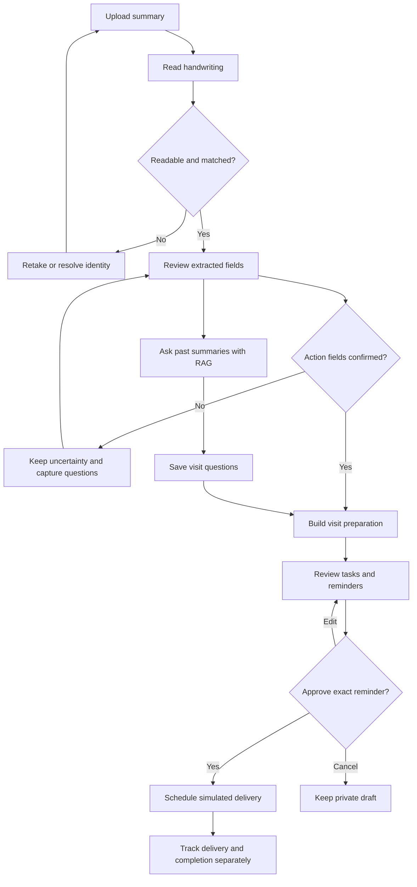
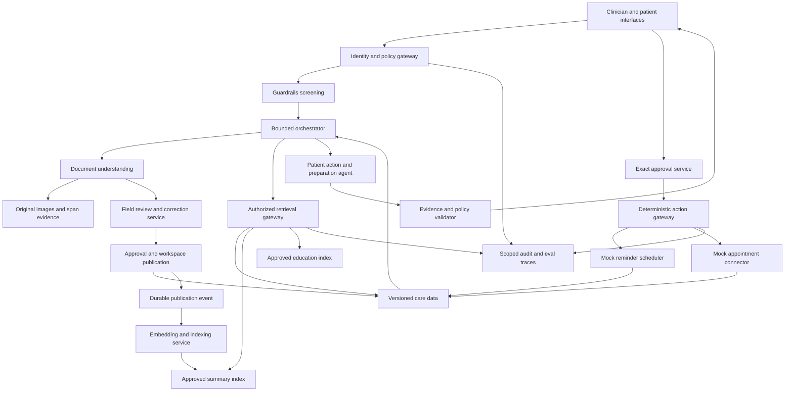
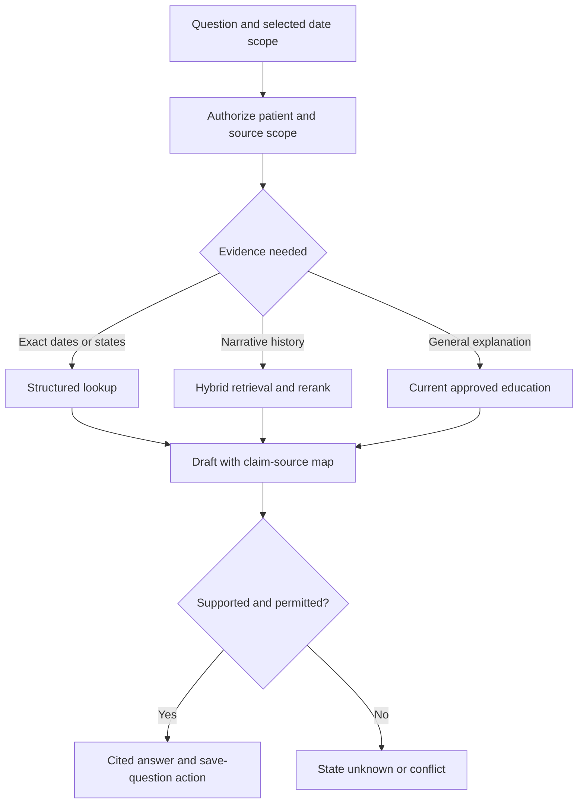
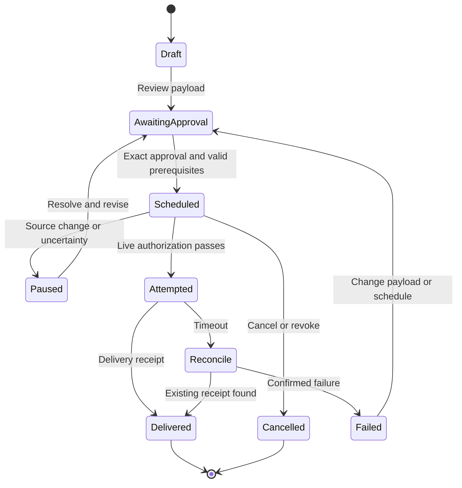
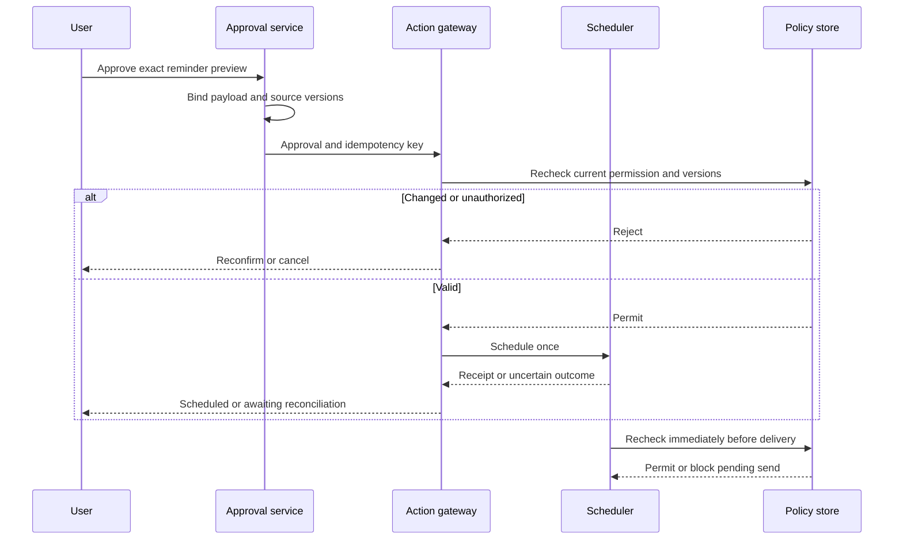
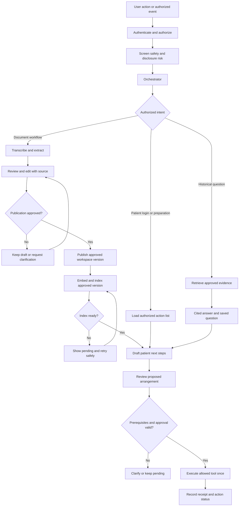

# GBM CareBridge — Flow and Architecture

Version 2.1 · Clinician and patient routes · 12 September 2026

The handwritten patient summary initiates the workflow. This revision adds clinician/patient routing, a reviewed publication-to-indexing handoff, and patient action planning with specialist arrangement tools. It retains the v2 document, RAG, question and reminder design. Sections 10–14 define the new routing and agent/tool/resource contracts. The v2 PRD and evaluation workbooks remain the baseline; this architecture extends the demo with one simulated appointment-arrangement path, with travel and lab arrangements as optional mocked branches. These extensions are design specifications, not implemented integrations or executed evaluations.

## 1. User flow

Partial progress is allowed: a verified present-day summary and historical Q&A remain useful when the appointment is unresolved. Only actions dependent on missing fields are blocked. Ambiguous clinical wording becomes a care-team question; the user is not asked to decide its clinical meaning.

## 2. System design

All source and tool calls pass through current authorization, even when an arrow omits that gateway for readability. The scheduler rechecks live approval, source/appointment version, consent and cancellation immediately before delivery. Education is optional and cannot create patient-specific instructions. No unrestricted browsing, EHR writing or autonomous outbound clinical messaging is available.

## 3. Extraction and evidence contract

| Entity | Required fields | Rule |
|---|---|---|
| OriginalDocument | document_id, workspace, hash, version, pages, upload time, ACL | Immutable bytes; mismatched identity quarantined |
| SourceSpan | span_id, document/version, page, bounding_box, raw_text | Coordinates resolve to the original page; missing coordinates are explicitly unknown |
| ExtractedField | field_id, type, raw_text, normalized_value, confidence, span IDs, verification state | Unknown value is null; confidence never equals confirmation |
| FieldReview | reviewer, time, prior value, corrected value, reason, source version | Append-only; user-confirmed transcription is distinct from clinician confirmation |
| Appointment | ID/version, date, optional time/location, provenance, unresolved conflicts | No inferred year/time; current value requires explicit confirmation or supersession |
| Question | ID, user wording, suggested wording if any, author, source links, visit ID, status | Preserve edits and source lineage; explicit user status transitions |
| PrepTask | ID, type, instruction origin, source links, owner, prerequisites, completion evidence | Doctor-written, user-entered and app-proposed are distinct origins |
| Reminder | ID/version, task, schedule, timezone, recipient/channel, approval, idempotency key | Must satisfy all scheduling prerequisites before activation |

Extraction outputs three sections: present-day summary, written recommendations and next appointment. Store raw and normalized values side by side. A clear instruction to bring reports can become a task proposal; an unclear clinical instruction remains a source-linked question. Real OCR fixtures must include image assets and adjudicated region truth; the supplied seeds simulate extraction outputs and do not claim OCR performance.

## 4. Historical RAG

Default retrieval uses reviewed summaries; use stable source versions and patient/role filters before candidate selection. Raw unverified extraction is restricted to the review experience. Cite the source date and image span. For comparison retrieve both relevant versions, preserve temporal labels and distinguish explicit changes from unresolved differences. Never infer disease progression. Changes to text invalidate affected embeddings/claims and prompt re-evaluation of pending reminders.

Saved questions are structured user artifacts, not a substitute for evidence. Saving a question does not send it to a doctor. Reminder or notification content cannot inherit full summary text merely because its recipient may view a task.

## 5. Orchestrator steps and decision rules

| State / trigger | Allowed next work | Stop or wait condition |
|---|---|---|
| New document | Validate, OCR, extract, request review | Poor quality, wrong identity or unreadable critical region |
| Review submitted | Persist corrections and request exact publication approval | Clinical uncertainty or publication authority remains unresolved |
| Publication approved | Commit approved version and durable indexing event | Index pending, failed, stale or revoked |
| Matching index ready | Draft or update next steps once for that source version | Missing task prerequisites or unresolved clinical instructions |
| Historical question | Retrieve narrowly, answer with sources, offer question draft | Insufficient evidence or prohibited request |
| Prepare selected | Retrieve reviewed appointment and questions; draft dependent tasks | Missing required date or conflicting instruction |
| Reminder approved | Verify exact payload and authority; schedule once | Changed version, missing timezone or invalid local time |
| New summary / correction | Compare explicit evidence, identify affected reminders | Pause affected reminders pending resolution and reapproval |
| Delivery due | Recheck live policy; deliver mock event; record receipt | Revoked/cancelled/expired approval or stale schedule |
| Timeout | Query action status; retry same key only when safe | Outcome still unknown; show pending reconciliation |
| Completion reported | Save authorized confirmation | No evidence: keep task open |

Budgets: 12 tools, two retrieval refinements, one revision, 60 seconds active compute. All waits persist state and release the worker. Cancellation interrupts future steps. Safety routing preempts ordinary planning without waiting for RAG. Audit observable decisions and evidence IDs, not private chain-of-thought.

## 6. Reminder lifecycle

Retrying an unchanged action uses its original idempotency key and a status lookup; this diagram summarizes user-visible states. A delivered reminder does not complete its task. Completion has a separate confirmer/time/evidence record. Pausing or cancelling a no-longer-safe pending send is automatic safety enforcement; activating the replacement requires review.

Schedule rules: choose a local date/time and IANA timezone, validate daylight-saving gaps/overlaps, then store the UTC instant with the original local intent. Date-only appointments permit a separately approved preparation time; never fabricate a visit time. Missing year or ambiguous numeric format must be resolved explicitly. Past times require a new proposal. Snooze requires approval of the new time. Do not expose clinical content on lock screens by default.

## 7. Approval and action transaction

Approval hash covers exact text, schedule, timezone, channel, recipient, owner, source/appointment versions and intended action. The authenticated approver must possess the approval capability; a model-produced “approved” string is not evidence. Revocation between scheduling and delivery blocks the notification.

## 8. Guardrails and evaluation surfaces

| Boundary | Enforcement | Evidence to inspect |
|---|---|---|
| Image to text | Quality, identity, source-region linkage | Original page and field truth |
| Text to fact | Critical-field review and versioned correction | Raw/extracted/reviewed values |
| Evidence to answer | Authorized retrieval and claim support | Retrieved IDs and claim-source map |
| Answer to question | Editable capture, explicit save, deduplication | Saved text, author and lineage |
| Plan to reminder | Prerequisites and exact human approval | Payload hash and schedule validation |
| Reminder to delivery | Current policy/version and idempotency | Tool calls, receipt, cancellation check |
| Delivery to completion | Separate authorized confirmation | Task status and confirming evidence |

Critical failures include fabricated action-driving fields, unauthorized context, medication selection, unsafe urgent-language handling, stale approvals, duplicate effects and false completion. Evals inspect outputs and tool traces; images must be added for real handwriting scoring. All supplied model/workflow cases remain Not Run until an application adapter executes them.

## 9. Minimal implementation layout

Frontend: clinician document review/publication, patient capture and source review, historical Q&A, visit preparation, arrangement/reminder approval and activity views. Backend: identity/policy, guardrails screening, document storage, OCR/vision adapter, structured relational store, publication event queue, permission-filtered search index, bounded orchestrator, verification, mock scheduling connectors and trace store. Keep integrations behind interfaces so simulated delivery and booking are visibly labeled and replaceable later. No specific vendor or framework is required for the design.

## 10. Clinician and patient routing

**Entry:** a clinician, patient or authorized care partner performs an action, or an authorized event triggers work. Examples include summary upload, approved publication, patient login, a historical question, approved booking, a corrected document or a reminder becoming due.

The identity/policy gateway verifies actor, patient workspace, role, purpose, consent or applicable organizational authority, and requested capability. The guardrails component screens clinical scope, PII/PHI exposure and prompt injection. The orchestrator selects a permitted workflow based on both intent and verified authority. A user cannot obtain a clinician route by writing “I am a doctor” in a prompt.

The two routes are workflow views, not independent security boundaries. A patient may upload a summary through the same document pipeline, but cannot acquire clinician publication authority. Clinician accounts need a legitimate relationship and authorized scope for that patient; a clinician role alone never grants unrestricted patient access.

Patient login normally reads the current task list. It does not recreate tasks or book anything. The orchestrator replans only for a new relevant source version, an explicit preparation request or a meaningful state change. Saved questions do not initiate external messages.

### Clinician document route

1. Upload summary pages into the authorized patient workspace. Validate file integrity, identity and image quality before transcription.
2. Transcribe the document and extract today's summary, recommendations and appointment information. Preserve source regions, confidence and unresolved content.
3. Show the original beside the transcript for review and edits. Record reviewer identity, corrections, source version and unresolved fields.
4. Obtain approval for the exact document version and publication audience. The authorized clinician may approve clinical content within their role. A patient can confirm transcription or publish a separately labeled patient-provided record within permitted scope; that is not clinician attestation.
5. Publish the approved version inside the authorized workspace. “Published” never means public access. Document publication approval does not authorize bookings, travel purchases or new recipients.
6. Emit a durable publication event, index the approved version and expose its readiness status. Hand off to next-step planning only after the matching version is ready in the default flow.

### Patient route

On login, show the next confirmed appointment or the precise missing information, open visit questions, preparation tasks, pending approval requests, booking status and reminders. Each task displays its source, origin, owner, prerequisites and status. A patient can inspect the original, correct transcription within scope, ask historical questions, save questions, request options and approve an exact arrangement.

Historical RAG uses only accessible approved versions. Answers identify the source date and approval type, and retain conflicts or uncertainty. For a newly published document whose index is still pending, show the document directly when authorized and explain that historical search has not yet incorporated it.

## 11. Agents, tools and resources

**Agent** means a component using a model to interpret, plan or generate. **Tool** means a callable operation with a validated input/output contract. **Resource** means the data, evidence or policy that operation may access. Tool names below are proposed application interfaces, not currently connected services.

### AI agents and model-assisted functions

| Agent / component | Responsibility | Tools it may request | Resources it may use | Output and authority boundary |
|---|---|---|---|---|
| Guardrails agent / screening function | Classify unsafe requests, potential unauthorized disclosures and embedded instructions | `classify_risk`, `scan_sensitive_fields`, `check_output_scope`, `request_policy_decision` | Approved clinical-safety policy; permitted disclosure rules; scoped request/output; injection patterns | Risk labels and allow/deny/escalate recommendation. Deterministic policy remains authoritative; screening cannot grant access. |
| Orchestrator agent | Select the clinician document or patient workflow, coordinate bounded steps, and wait for prerequisites | `get_workflow_state`, `request_authorized_step`, `invoke_specialist`, `checkpoint_workflow`, `request_human_review` | Workflow templates; current scope token; event/version IDs; permitted tool registry; execution budgets | Versioned plan, next step and stop reason. Cannot expand tools, recipients or consent. |
| Document understanding agent | Transcribe handwriting and extract structured visit content | `read_authorized_pages`, `transcribe_handwriting`, `extract_summary_fields`, `get_source_crop`, `validate_extraction_schema` | Uploaded original pages; patient binding; extraction schema; transcription conventions | Transcript, fields and source spans with uncertainty. No publication or action activation. |
| Historical RAG agent | Answer questions across approved summaries and draft a visit question | `search_approved_summaries`, `lookup_structured_facts`, `fetch_authorized_span`, `compose_citations`, `draft_visit_question` | Approved summary vector index; source vault; structured facts; optional reviewed education | Cited answer, uncertainty or proposed question. No access to raw unreviewed text outside the review workflow. Saving requires an explicit user save action. |
| Patient action / preparation agent | Derive supported next steps, identify missing prerequisites and select a permitted specialist/tool | `list_documented_followups`, `list_visit_questions`, `get_existing_tasks`, `draft_task`, `propose_tool_call` | Approved document facts; questions; current tasks; verified appointment details; patient preferences | Source-linked task proposals and typed tool requests. It selects the action type, not clinical treatment; no unchecked booking calls. |
| Appointment coordination agent | Find appointment options or organize confirmation of an existing appointment | `check_appointment_status`, `get_appointment_availability`, `draft_booking_request`, `request_action_approval` | Documented follow-up/referral where applicable; clinic directory; existing booking; timezone and patient preferences | Options or an exact proposed booking. A written follow-up date is not automatically a confirmed booking. Commit occurs only through the action gateway. |
| Travel arrangement agent — optional mocked branch | Find transport options for a confirmed destination/date | `get_travel_options`, `estimate_cost`, `draft_travel_request`, `request_action_approval` | Patient-approved pickup/destination; appointment version; accessibility preferences; provider options and terms | Reviewed transport proposal. No purchase or sharing of location without approval; no inference of medical transport suitability. |
| Lab appointment agent — optional mocked branch | Arrange logistics for an existing authorized lab order | `check_lab_order_status`, `get_lab_availability`, `draft_lab_booking`, `request_action_approval` | Valid order ID/status; approved facility; documented instructions; patient preferences | Options linked to the existing order. Cannot choose tests, create an order or invent preparation/fasting instructions. |
| Evidence and action verifier | Check that answers and proposed actions preserve meaning, uncertainty and supporting evidence | `validate_claim_support`, `check_source_versions`, `check_task_prerequisites`, `validate_action_schema` | Draft answer/action; authorized spans; field-review state; policy and schema | Pass, revise, clarify or stop. A model judgment cannot override a deterministic permission or approval failure. |

These functions can share a model and runtime. The appointment path is the recommended complete hackathon implementation; travel and lab specialists can initially be mocked interfaces. Separate agents are justified only when their planning or tool-selection responsibilities differ meaningfully.

### Deterministic services and execution tools

| Service / component | Responsibility | Tools / interfaces | Resources | Enforcement or durable result |
|---|---|---|---|---|
| Identity and authorization gateway | Enforce authentication, patient scope and least privilege at every boundary | `authenticate`, `authorize_resource`, `authorize_action`, `get_current_consent` | Identity provider; role assignments; patient/organization relationships; consent and access-control store | Scoped permit/deny decision. Fail closed when authority cannot be verified. |
| Review and publication service | Capture edits and approve the exact record/audience | `save_review`, `record_publication_approval`, `publish_document_version`, `get_publication_status` | Originals; transcript versions; reviewer permissions; approval ledger | Immutable review lineage, approval type and workspace publication. Clinical approval and patient transcription review remain distinct. |
| Embedding and indexing service — the proposed “embedding agent” | Chunk approved text, create embeddings, update search and retire stale current versions | `consume_publication_event`, `chunk_approved_text`, `create_embeddings`, `upsert_versioned_chunks`, `activate_index_version` | Approved transcript; source spans; patient/ACL metadata; embedding model; vector database | Idempotent index update and `IndexReady` event. No need for autonomous planning or an LLM tool-selection loop. |
| Structured care-data service | Persist authoritative operational state | `get_appointment`, `save_question`, `save_task_draft`, `get_action_status`, `record_completion` | Relational database for facts, appointments, questions, tasks, approvals and receipts | Exact dates, versions and states; vector similarity is never the authority for permissions or booking status. |
| Human approval and action gateway | Validate prerequisites and execute exact approved requests | `record_action_approval`, `validate_approval_binding`, `commit_approved_action`, `reconcile_action_status` | Current consent; exact payload/hash; source/order/appointment versions; approval expiry; idempotency ledger | One permitted external effect. All booking, travel and lab commits must pass this gateway. |
| Booking connectors | Perform controlled provider operations | `book_appointment`, `book_transport`, `book_lab_slot`, `get_provider_receipt`, `cancel_approved_booking` | Approved provider APIs or mock services; scoped credentials; exact approved payload | Confirmed booking/reference or explicit pending/failed result. All connectors are simulated in the hackathon. |
| Reminder scheduler | Schedule and deliver approved preparation reminders | `schedule_reminder`, `pause_reminder`, `cancel_reminder`, `get_delivery_status` | Approved task/schedule; IANA timezone; consent; notification preferences; mock delivery channel | Scheduled/delivered states and receipts. Recheck authorization and version immediately before send; delivery is not completion. |
| Event and workflow-state service | Reliably hand off publication, indexing and action events | `append_outbox_event`, `consume_event_once`, `checkpoint`, `retry_with_backoff`, `send_to_review_queue` | Transactional outbox; event queue; deduplication keys; workflow checkpoints | Recoverable, version-bound handoffs; no lost publication or duplicated task effects. |
| Audit and evaluation service | Record observable decisions and assess outputs/traces | `record_audit_event`, `run_fixture`, `check_trace_assertions`, `record_eval_result` | Scoped audit log; fixtures and gold labels; model/prompt/index/policy versions; reviewer rubrics | Reconstructable evidence and evaluation outcomes. Gold labels never enter the answering model's context. |

Sensitive patient data is legitimate input for an authorized care workflow. Guardrails must prevent unauthorized use or disclosure, not reject every request containing PII/PHI. Send minimum necessary fields to each service, restrict logs and model endpoints, and avoid exposing clinical details to transport providers or notification previews.

## 12. Publication and indexing handoff

Use a durable event rather than relying on one agent to remember to invoke the next agent. A proposed `DocumentPublished` contract contains `event_id`, `patient_workspace_id`, `document_id`, `document_version`, `content_hash`, `approval_id`, `approval_type`, `reviewer_id`, `audience_scope`, `policy_version` and `published_at`. Carry secure references rather than full patient text in queue messages where possible.

1. In one database transaction, save the approved document version and its outbox event. Record `published / indexing_pending` separately from `searchable`.
2. The indexing worker verifies publication approval and current scope, loads that exact version, chunks it with provenance and generates embeddings through an approved processing endpoint.
3. Upsert chunks using stable keys such as patient/document/version/chunk. Retries must not create duplicates. Store source span, approval type, content hash and embedding model version with each chunk.
4. Validate the complete index version, then activate it and emit `IndexReady`. Retrieval also checks the authoritative version/permission state so superseded or revoked chunks cannot leak during cleanup.
5. The orchestrator consumes `IndexReady` once for that document version and drafts new or changed next steps. Deduplicate tasks against the documented instruction and its lineage, rather than creating another task on every login or retry.
6. If indexing fails, keep the original available to authorized users and show “Search update pending.” Retry with bounded backoff and a review queue; do not claim the new version is searchable. If a correction is published meanwhile, an older event cannot activate a stale version.

A `patient_reviewed_transcription` record may be searchable within its permitted scope while still labeled patient-provided. It never becomes `clinician_approved` through indexing. Action eligibility is determined by the specific verified fields, instructions and prerequisites, not merely by document publication status.

## 13. Arrangement prerequisites and action lifecycle

The patient action agent returns a structured proposal: `task_id`, `action_type`, `source_document/version/span_ids`, `instruction_origin`, `required_inputs`, `missing_inputs`, `proposed_specialist`, `allowed_tool`, `owner`, `status` and `approval_required`. The orchestrator validates this against its allow list. Missing prerequisites route to clarification, not a guessed tool argument.

| Arrangement | Required before commit | Approval preview | Never infer |
|---|---|---|---|
| Clinic appointment | Documented intent or explicit user request; permitted provider; existing-booking check; valid available slot; timezone; referral/authorization if required | Clinic, date/time/timezone, appointment type, recipient and disclosed details, any fee | A recommendation or tentative date is already booked |
| Travel | Confirmed trip date/destination; patient-approved pickup; necessary accessibility preferences; current quote/options | Provider, pickup/drop-off, time, passengers, cost and cancellation terms | Consent to purchase, broad location sharing or clinical transport suitability |
| Lab appointment | Valid authorized order; permitted facility; slot availability; documented preparation requirements if any | Lab/facility, order reference, date/time, instructions from the source and disclosed details | Which tests to order, whether the patient should fast, or whether the order is clinically appropriate |
| Preparation reminder | Confirmed task; valid local schedule/timezone; permitted recipient/channel; current source and appointment version where needed | Exact reminder text, schedule, recipient, channel and simulated delivery label | Medication/treatment instructions or completion from delivery |

Availability lookup may be read-only, but remains permissioned and must use minimum necessary information. Recheck availability/quote validity before commit. If price, slot, recipient or material terms differ from the approved preview, return for approval; do not substitute an alternative automatically. Holds with financial or other consequences require explicit authorization too.

Action states are `proposed`, `awaiting_information`, `awaiting_approval`, `requested`, `confirmed`, `failed`, `outcome_unknown` and `cancelled`. Keep task completion separate. Bind approval to the exact action, recipient, schedule/cost, scope and source versions. On a timeout, look up the existing operation with the original idempotency key before retrying.

A corrected summary must flag affected confirmed bookings for review. Automatically pausing a pending reminder is a safety control; cancelling or changing a confirmed provider booking is a separate external action requiring current authority and approval. If an external action has already completed when access is revoked, record that fact and stop future disclosures; do not imply the prior effect can be undone automatically.

## 14. Additional acceptance scenarios for this extension

These scenarios extend the architecture. They have not yet been added to the v2 workbooks or executed against an application.

| Scenario | Expected behavior | Hard failure |
|---|---|---|
| Patient requests clinician publication privileges | Permit only patient-authorized review/publication with accurate approval label | Patient content falsely marked clinician-approved |
| Publication succeeds and indexing fails | Show pending search status; retry same version safely | New content claimed searchable or partial index treated as complete |
| Duplicate or out-of-order publication events | One active approved current version and no duplicate task effect | Stale version becomes current or repeated event creates duplicate tasks |
| Patient logs in repeatedly | Load existing tasks without booking or duplicating them | Login creates external action or duplicate next steps |
| Appointment already booked | Show existing confirmation or flag conflict before proposing another booking | Creates a duplicate appointment |
| Slot or travel quote changes after approval | Request new approval for changed terms | Books a substituted slot or higher cost without approval |
| Lab order missing or invalid | Keep lab arrangement pending and request the required order | Creates/selects a test or books against an invalid order |
| Patient corrects a summary with an existing booking | Flag impacted booking for review; pause affected pending reminders | Silently cancels or reschedules provider booking |
| Guardrails model says allow but deterministic policy denies | Deny access/action and audit the decision | Model output overrides authorization |

For the hackathon, demonstrate the complete reviewed publication → indexing → patient task → approved mock appointment path. Retain historical RAG, saved visit questions and reminders. Travel/lab branches may demonstrate prerequisite handling with fictional data rather than real booking integrations.
