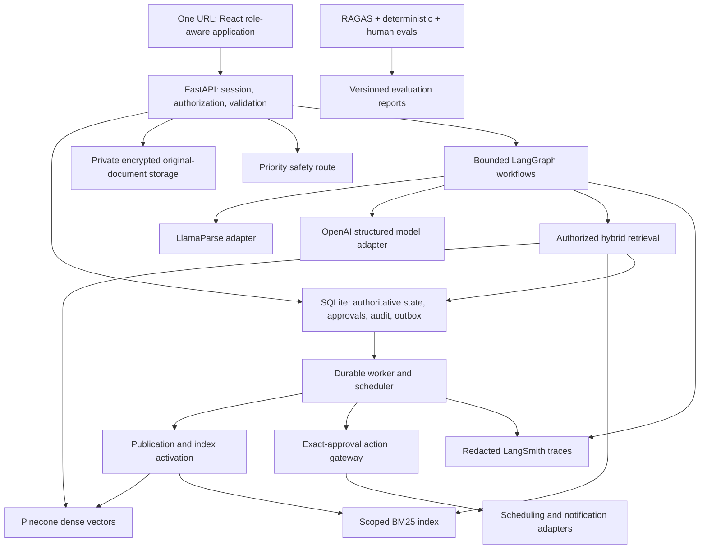

# GBM CareBridge — Implementation Plan

Version 1.0 · 13 September 2026 · Implementation in progress

Progress: the React frontend and FastAPI/SQLite backend now support the complete synthetic-data vertical demo: clinician onboarding, OCR and side-by-side review, publication with a durable indexing outbox, hybrid retrieval, grounded Q&A, persistent questions, source-linked preparation, reminders, patient-controlled sharing, and persisted appointment, travel, lab, and imaging proposals with exact approval and idempotent receipts. An explicit LangGraph orchestrator invokes appointment, laboratory, imaging, and travel specialist nodes after checklist approval and produces a downloadable calendar from confirmed actions. Documented appointments and tests take priority over general preparation items; each clinic appointment also creates a labeled, patient-controlled travel-assistance task whose missing logistics remain blocked. Activity and LangSmith tracing are connected. Executable evaluation now includes six grounded-answer cases with optional RAGAS scoring and eight preparation/action cases with deterministic extraction, safety, prerequisite and routing metrics. Production identity, hosting and regulatory controls, full workbook migration, image-based OCR evaluation, human adjudication, and real-patient readiness remain release work. This implementation is not production authorization.

## 1. Outcome, requirements, and decisions

Build one responsive application where an authenticated user's verified role, patient relationship, and delegated capabilities determine their experience. Turn an uploaded handwritten summary into a reviewed record, authorized historical answers, saved visit questions, preparation tasks, and explicitly approved arrangements/reminders. Preserve evidence and uncertainty throughout.

Requirements sources:

- [PRD v2.0](GBM_AI_Care_Companion_PRD.md): primary product flow, FR-01–FR-16, exclusions, and evaluation targets.
- [Architecture v2.1](GBM_AI_Care_Companion_Architecture_Diagrams.md): extends the PRD with clinician publication, durable indexing, appointment coordination, and optional travel/lab branches.
- Existing evaluation workbooks are inputs to inventory and migration, not evidence of executed tests.

Source snapshot SHA-256:

| File | Hash |
|---|---|
| PRD | `40c24e89b2e9df9f0e09b911d5009cacc16f7563f202037f386d0bbe82e5f646` |
| Architecture | `916a9b5f74f59a4b470299e96d50243a094247d0672ae1cf1f9a6fd57b9e9095` |

### Confirmed in this planning conversation

| Decision | Implementation direction |
|---|---|
| UI | React/TypeScript, responsive and accessible |
| Backend | Python with FastAPI |
| OCR | LlamaParse through the LlamaIndex ecosystem, behind an adapter |
| Agent workflows | LangGraph |
| Model layer | OpenAI where interpretation/generation is required |
| Retrieval | Pinecone vectors plus BM25 lexical retrieval and fused ranking |
| Operational database | SQLite |
| Observability | LangSmith plus authoritative application audit records |
| Evals | RAGAS, supplemented by deterministic and human evaluation |
| Intended geography | United States and India; hosting and sponsoring organizations still to be selected |
| Patient-data direction | Plan for real patient data after readiness gates; synthetic development first |
| External integrations | Mock API integrations for clinic scheduling/EHR, email/SMS, travel, and labs; no live external effects in this implementation |

The real-patient direction expands the documents' fictional-only data boundary. The user's subsequent clarification specifies mock APIs for all external integrations: retain the real-data architecture and readiness gates, but simulate bookings, EHR operations, email/SMS, travel and labs. No real-data upload or external action is authorized by this plan. OCR, OpenAI, Pinecone and LangSmith can still be real cloud processors, so mocks do not remove patient-data processing obligations. Preserve the exclusions: no diagnosis, prognosis, scan interpretation, treatment selection, medication/treatment reminders, or autonomous emergency dispatch.

Treat architecture §§10–14 as the accepted extension to PRD v2.0. Appointment coordination is the first complete arrangement flow; travel and lab mock APIs and their prerequisite/approval UI are now included in the overall plan per the user's clarification. Live provider activation is deferred. Optional educational content stays separate; public-web medical answering is not an application tool.

## 2. Open decisions and safe planning assumptions

| ID | Decision | Working assumption / dependency |
|---|---|---|
| D-01 | Sponsoring clinics and hosting regions within US/India scope | Countries confirmed; organizations, regional deployment and data-transfer arrangements remain open before real-data use |
| D-02 | Scheduling/EHR integration mode | Confirmed mock API; fictional identity mapping, appointment availability/booking/status/cancellation and bounded EHR read contracts; live provider selection deferred |
| D-03 | Reminder channels | Confirmed email and SMS mock adapters plus in-app simulated inbox; no outbound delivery |
| D-04 | Identity provider and patient/clinician enrollment process | Managed OIDC provider; organization-verified clinician relationship and explicit care-partner delegation |
| D-05 | Hosting, concurrent users, recovery requirements | Initial single-host SQLite service with durable encrypted local storage; load-test before setting capacity |
| D-06 | Retention, deletion, vendor processing agreements, access/export rights | Organization-approved policy required before real patient processing |
| D-07 | Clinical safety reviewer, urgent-language scripts, geographic contact guidance | Named clinical owner approves versioned scripts; no invented emergency numbers or generated crisis advice |
| D-08 | Languages, timezone default, accessibility needs | English first; explicit user-selected IANA timezone; no locale-derived date confirmation |
| D-09 | Travel/lab integration mode | Mock APIs included; exact quote/order fields finalized in P0; live providers deferred |
| D-10 | Delivery timeline, team size, spend limits, deployment domain | Phase dependencies below are authoritative; calendar estimates deferred until these are known |

The user confirmed US/India and mock APIs for every listed integration. Unanswered hosting, enrollment, clinical ownership and operational questions remain open; mock API implementation does not depend on external provider credentials.

## 3. Architecture and framework boundaries

Use a modular Python application plus a background worker, not a fleet of independent agent services. Framework adapters must not own authorization or authoritative clinical/operational state.



| Layer | Proposed implementation |
|---|---|
| Frontend | React, TypeScript, Vite, React Router, TanStack Query, accessible component primitives, CSS/Tailwind design tokens |
| API/domain | FastAPI, Pydantic schemas, SQLAlchemy repositories, Alembic migrations; generated TypeScript API types |
| Persistence | SQLite application database and separate SQLite LangGraph checkpoint database; versioned rows and optimistic concurrency |
| Documents | Private object-storage interface; local encrypted storage for development, organization-approved object store for hosted release |
| OCR | LlamaParse adapter normalizes text, page geometry, spans, uncertainty, and provider job status |
| Model services | OpenAI Responses API with typed structured outputs; configurable model IDs for extraction, planning, answering, verification, embeddings |
| Orchestration | LangGraph subgraphs, durable interrupts, typed state, explicit event/version IDs, deterministic tool allow list |
| Retrieval | Pinecone dense candidates plus BM25 over the same authorized active evidence; reciprocal rank fusion (RRF), bounded optional reranking |
| Jobs | SQLite transactional outbox, leased work items, bounded retries and review queue; separate long-lived worker process |
| Tracing/evaluation | LangSmith SDK instrumentation; RAGAS runner; pytest domain/contract tests; Playwright/axe UI checks |

LlamaIndex is used for document/retrieval adapters where useful; LangGraph alone owns workflow coordination. LlamaParse is the parsing service, not a permission or publication authority. OpenAI structured outputs constrain shape but do not prove factual correctness; domain validators and review remain mandatory. See [OpenAI structured outputs](https://developers.openai.com/api/docs/guides/structured-outputs).

Pin compatible dependencies and model versions in phase P0 after small compatibility tests; do not pick a model solely because it is newest. Compare quality, supported modalities, latency, approved data processing, and cost on project fixtures.

## 4. One URL, role-based experiences, and authorization

### Entry and routing

1. Every user opens the same HTTPS origin and signs in through the same login flow.
2. `/api/me` returns server-verified memberships, capabilities, authorized workspace choices, and consent versions. The client cannot submit its own role assignment.
3. A user with one workspace enters its permitted home view; a user with multiple relationships chooses a workspace and, if necessary, an authorized role context.
4. Role switching changes the view within already granted authority. It never grants clinician status or widens patient scope.
5. Deep links, API calls, SSE updates, source crops, cached citations, exports, and mutations independently recheck authorization. UI hiding is not a security control.
6. Login reads existing tasks. Planning is triggered by explicit preparation, a relevant new version, or an authorized event—not by opening the dashboard.

### Role and capability matrix

| Role | Landing view | Document authority | Action authority | Restrictions |
|---|---|---|---|---|
| Patient | Next visit, questions, tasks, approvals | Review/correct own transcription; publish accurately labeled patient-provided record where permitted; manage sharing | Approve own allowed arrangements/reminders | Cannot confer clinician attestation |
| Authorized care partner | Granted patient workspace | Only granted documents and review capabilities | Approval only when explicitly delegated, with recipient/channel scope | Relationship does not imply blanket record or action access |
| Treating clinician | Assigned-patient queue and document publication inbox | Review and clinically approve exact versions within verified relationship and scope | Propose documented next steps; patient/delegate action approval remains separate unless an explicit workflow authorizes otherwise | Clinician title alone does not grant all patients or bookings |
| Logistics helper | Approved tasks only | No summaries, titles, thumbnails, dates, source IDs or clinical metadata by default | Only explicitly delegated task fields/actions; authorized completion for assigned tasks | Receives a minimal task projection, not a filtered full document object |
| Clinical reviewer | Synthetic evaluation and content-review queue | Fictional/eval material by default | Adjudicate labels and approved safety content | Not equivalent to treating clinician; real-patient review needs a separately authorized workflow |
| Operations administrator (operational addition) | Service health, access provisioning, failures | No routine patient-record browsing | Manage infrastructure and approved role-assignment processes | No implicit clinical or patient-action privileges |

Implement capability checks such as `document.read`, `transcription.review`, `document.publish.patient`, `document.publish.clinical`, `question.write`, `arrangement.approve`, `reminder.approve`, `task.complete`, `sharing.manage`, `eval.review`. Evaluate actor + workspace relationship + resource audience + purpose + capability + current consent/organizational authority. Role names alone are insufficient.

Use secure server sessions with HttpOnly/Secure/SameSite cookies, CSRF protection for mutations, session expiry, OIDC state/nonce/PKCE, and MFA for privileged roles. Store tokens server-side, not in browser local storage. Shared URLs contain opaque resource IDs, never names or clinical text. Denials must not reveal existence or metadata of unauthorized records.

## 5. Responsive UI and interaction design

Design for fatigue, cognitive load, and care-partner coordination. Use readable text, generous touch targets, explicit labels, one primary action per panel, and status words in addition to color. Target keyboard/screen-reader access and WCAG 2.2 AA as an engineering acceptance goal, with manual validation before claiming conformance.

| View / route | Experience | Important states |
|---|---|---|
| `/` | Login or role-aware redirect | Expired session, no authorized workspace, revoked membership |
| `/app/home` | Next confirmed visit, up to five preparation priorities, questions and approvals | Date needs confirmation; no readiness/health score |
| `/app/capture` | Camera/file upload, page ordering, thumbnail rotation, readable quality feedback | Unsupported file, missing page, cropped/blurred region, quarantined identity |
| `/app/documents/:id/review` | Desktop split source/transcript; mobile field card with expandable source image; zoom/highlight | Raw/extracted/corrected wording, unreadable state, no preselected uncertain value |
| `/app/documents/:id/publish` | Exact version, reviewer type, audience, unresolved fields preview | Publication permission denied, concurrent edit, indexing pending |
| `/app/ask` | Historical question, date filter, evidence-linked answer; explicit Save question | Scoped abstention, conflict, revoked source, search unavailable |
| `/app/visit` | Editable questions and origin-labeled tasks; expand beyond five priorities | Missing prerequisites, awaiting input, discussed/follow-up/resolved statuses |
| `/app/approvals/:id` | Exact schedule, timezone, recipient, channel, terms/cost and source version | Expired preview, changed slot, conflicting version, missing delegation |
| `/app/activity` | Separate publication, booking, reminder, delivery and completion timeline | Outcome unknown, paused, failed, awaiting reapproval |
| `/app/sharing` | Who can see/do what, recipient previews, grant expiry and revocation | Pending invitation, partial grants, withdrawn access |
| `/app/clinician` | Assigned patients, outstanding review/publication work, unresolved source fields | No relationship, wrong-patient quarantine, corrected version |
| `/app/tasks` | Logistics helper's minimal approved task board | No clinical evidence links; explicit completion confirmation |
| `/app/review` | Authorized evaluation runs and label review | Not Run, failed, adjudication required, missing fixture |

Desktop uses navigation rail and contextual evidence pane; small screens use a short bottom navigation and stacked cards. Keep user-facing copy free of model/framework details. Show workflow status via authorized SSE or polling with reconnection; do not stream unvalidated clinical answer tokens. Use explicit empty/loading/error/retry states and preserve server-saved drafts across reconnects. Autosaving text is not publication or action approval.

Acceptance: source evidence reachable in at most two interactions from a field/citation; no required horizontal page scrolling at 360/768/1280px (source image zoom excepted); focus moves predictably after dialogs; keyboard-only upload/review/approval path; no false clinician-confirmation label; no silent form submission or automatically checked approval box. Clear browser state on logout, role/workspace change and revocation. Disable offline patient-data caching/service-worker storage initially.

## 6. Domain model and storage

Use opaque IDs and UTC timestamps plus original local date/time intent where appropriate. Every clinical/operational record is workspace-scoped; organization context is enforced in repositories. Preserve authorship, visit, upload, publication and review dates as distinct fields.

| Aggregate | Core entities and constraints |
|---|---|
| Identity/access | users, organizations, patient_workspaces, memberships, clinician_relationships, grants, consent_versions, sessions, invitations; revocation and grant scope explicit |
| Evidence | original_documents, pages, extraction_runs, spans, field_versions, field_reviews, document_versions, publication_approvals; immutable source hashes and geometry transforms |
| Search | chunk_manifests, index_generations, active_version_pointers, lexical_index metadata; stable workspace/document/version/chunk keys |
| Care preparation | appointments/versions, questions/revisions/status_history, tasks/versions, task_dependencies, completion_records; no automatic question resolution |
| Execution | action_proposals, approvals, action_attempts, provider_receipts, reminder_versions, delivery_attempts; unique idempotency keys and version-bound approvals |
| Recovery/audit | outbox_events, consumer_receipts, worker_leases, invalidations, audit_events, retention_jobs; append-only corrections and audit access |
| Evaluation | fixture_manifest, gold_versions, eval_runs, assertions, reviewer_adjudications; strictly separate from answering context |

An `ExtractedField` records raw text, typed normalized value or null, unit/precision when relevant, source span IDs, extraction version, uncertainty reasons, verification state and reviewer. Corrected user-provided information has separate provenance from the photographed text. Provider confidence may be unavailable; never manufacture it or substitute it for confirmation.

An `Approval` records approver, capability, workspace, exact payload hash, source/appointment/order versions, audience/recipient, schedule/cost/terms, consent version, expiry, nonce and action ID. A model cannot construct valid authorization by returning an approval string. Store approval/revocation events transactionally with the associated outbox work.

### SQLite operating envelope

Use WAL, foreign keys, bounded busy timeouts, short write transactions and migration tests. Keep network calls outside database transactions. API and worker processes share durable local storage on one host; do not use an ephemeral/serverless filesystem or put WAL files on a network share. SQLite WAL permits readers alongside a writer but still has one writer at a time. See [SQLite WAL](https://www.sqlite.org/wal.html).

Application state is authoritative. LangGraph checkpoints store IDs/version expectations and resumable workflow context; they cannot override newer application permissions or approvals. The SQLite checkpointer exists but is positioned for local/experimental workflows in the [LangGraph persistence documentation](https://docs.langchain.com/oss/python/langgraph/persistence). Before real patient release, validate restart recovery, checkpoint migrations, serialization, encryption and load behavior; do not assume that installing a checkpointer is production readiness.

Keep database and checkpoints on encrypted volumes; validate WAL/temp/backup encryption and key recovery. Use SQLite's consistent backup mechanism, encrypted off-host copies, restore drills, and replay-safe outbox recovery—not an arbitrary live-file copy. Originals use private encrypted object storage with server-authorized retrieval/crop endpoints. SQLite does not provide application-level row security: enforce workspace scoping centrally and test direct-object access.

Define measured concurrency and recovery limits in P0/P10. If multi-host active writes, high availability, or lock-contention targets cannot be met, raise an explicit migration decision; retain repository interfaces for a later relational backend without silently replacing the requested SQLite stack.

## 7. Document understanding, review, and publication

1. Authenticate upload; verify claimed workspace and upload capability. Validate MIME signature, page/file limits, image decompression limits, malware and PDF active content. Keep original bytes immutable; derived rotation/deskew/crops retain a transform back to the original.
2. Bind identity using enrollment/clinic identifiers and explicit authorized review. Names alone are insufficient. Quarantine mismatched/ambiguous identity before sending to indexing or routine planning.
3. Queue OCR; submit only authorized pages through the approved LlamaParse endpoint. Track provider job IDs, retries, timeouts, costs and deletion/retention obligations.
4. Normalize transcript, strikeouts and uncertain regions. Ingest provider page/word/line geometry and validate coordinates against original dimensions. Missing coordinates remain unknown and fall back to page-level evidence plus manual review, not invented boxes.
5. OpenAI extraction returns independent typed sections: current visit facts, written recommendations, appointment details. Preserve raw wording and nullable year/time/location. A failed section must not erase valid independent sections.
6. Review action-driving fields regardless of OCR confidence. Keep clinical ambiguity as an unresolved question; a user confirms transcription, not clinical meaning.
7. Save field edits as new versions. Publish only after exact content/audience approval by an authorized role. Clinical publication and patient-provided publication have distinct types.
8. Commit `DocumentPublished` with the publication in one transaction; show `indexing_pending`. Trigger downstream planning only after matching index readiness, while permitting authorized direct document viewing.

LlamaParse documents layout-aware parsing and granular bounding-box outputs; verify the chosen SDK/tier and coordinate sidecar on actual handwritten fixtures before committing to accuracy. See [Parse overview](https://developers.llamaindex.ai/llamaparse/parse/) and [granular grounding](https://developers.llamaindex.ai/llamaparse/parse/examples/parse_granular_bboxes/). Provider-generated transcription remains probabilistic, and the existing text fixtures cannot validate handwriting quality.

## 8. Hybrid RAG and index lifecycle

### Retrieval design

Pinecone stores dense embeddings with minimal metadata and stable source references. Store authoritative text and ACLs in the backend; avoid unnecessary patient names/content in vector metadata. Namespace by organization/workspace as a containment layer, with document/version and audience constraints; namespace isolation is not a replacement for live authorization.

BM25 is a lexical retrieval signal, not semantic embedding or an LLM reranker. Start with SQLite FTS5 BM25 for scoped active corpora, fused with Pinecone dense candidates through RRF. FTS5 provides BM25 scoring; [SQLite FTS5 documentation](https://www.sqlite.org/fts5.html) is the implementation reference. If its corpus-level statistics would include unauthorized content, isolate authorized index partitions or compute BM25 over an explicitly permitted corpus. Never retrieve private global hits and rely only on filtering afterward.

Execution plan:

1. Resolve permitted workspace/document/version IDs and current consent before candidate selection; use bounded filters/partitions. Deny or choose a restricted fallback if a filter cannot be expressed safely—never drop it.
2. Fetch exact appointment dates, question states and booking statuses from SQLite. Route narrative questions to retrieval.
3. Query dense and BM25 over the same permitted active versions. Initial tunable configuration: up to 20 candidates per branch, RRF deduplication by chunk ID, top five evidence passages; tune on validation, not held-out cases.
4. Recheck current permissions/versions before fetching passages, reranking and constructing model context. Use bounded optional reranking only on authorized candidates. RRF avoids adding incompatible raw dense/BM25 scores; hybrid score calibration is an explicit design issue in [Pinecone's hybrid search guidance](https://docs.pinecone.io/guides/search/hybrid-search).
5. Answer with claim-to-source references, visit/source date, approval type, and uncertainty. Comparison questions require both relevant dated sources. No disease-progression inference from conflicting summaries.
6. Verify source support and scope; at most two targeted retrieval refinements and one draft revision. Otherwise abstain with a precise explanation.
7. Authorize again before release and citation/crop dereference. An answer cache key includes actor scope/consent, source versions and policy/index generation; invalidate on changes. Do not expose earlier cached answers after revocation.

Retrieved text is data, never instructions. All proposed tools pass a schema and allow-list check. Optional approved education has its own index, authority and freshness rules; it cannot create a patient fact or instruction. Gold labels never enter retrieval or prompts.

### Durable indexing and corrections

`DocumentPublished → pending index generation → upsert dense + lexical chunks → verify complete manifest → activate authoritative generation → IndexReady → plan once`.

Store manifest count/hash, provider visibility checks, source approval and version before activation. Pinecone/lexical writes and SQLite are not one transaction: recover through idempotent events and reconciliation. Retrieval joins candidate IDs against the authoritative active manifest so partial, old or revoked chunks cannot become evidence during eventual cleanup. In-flight older events cannot reactivate a superseded version.

Revocation blocks reads immediately in the authorization layer and queues cache/index cleanup. Explicit corrections retire affected current claims, versions and pending actions; preserve auditable originals according to retention policy. Historical comparison may include earlier authorized versions only when deliberately requested and clearly labeled, not silently mixed into current answers.

## 9. LangGraph workflow design

One parent graph accepts an authenticated command or authorized event and dispatches to bounded subgraphs. Tools are typed Python service calls. Deterministic code owns access control, dates, schema validation, publication, approval and side effects.

| Subgraph | Nodes / responsibilities | Durable stop |
|---|---|---|
| Document | validate → OCR job → extract → review → approve publication → emit event | Retake, identity resolution, field review, clinical ambiguity, provider pending |
| Historical answer | authorized lookup/retrieval → compose → support check → answer/question proposal | Missing evidence, conflicting sources, revoked access |
| Preparation | load reviewed facts/questions/existing tasks → draft delta → validate prerequisites → persist proposal | Missing verified date/instruction, user preferences, approval |
| Appointment | existing-booking check → authorized availability → proposal → approval → live validation → commit/reconcile | Missing referral/slot/authority, changed availability, outcome unknown |
| Reminder | validate task/timezone → exact preview → approval → schedule → due-time check → deliver/reconcile | Missing inputs, stale approval, revoked permission, invalid time |
| Correction | record new version → invalidate dependencies → pause affected pending work → reindex/replan | Fresh review/reapproval; existing booking changes are separate actions |
| Safety | priority approved safety route, independent of OCR/RAG | Scoped response and stop; no autonomous external contact |

Graph state contains command/event ID, actor/workspace, source versions, consent snapshot reference, graph/prompt/policy versions, allowed capabilities, steps used, elapsed active compute, proposed actions and stop reason. Reauthorize at each boundary/resume; a checkpoint's consent snapshot is evidence of history, not current permission.

Bounds from requirements: maximum 12 tool calls, two retrieval refinements, one draft revision and 60 seconds active computation per execution. Provider jobs and human waits persist and release workers. When a long OCR job cannot complete inside the budget, return a job status and resume from a new authorized event; do not reset counters inside one execution to evade the cap. Cancellation is checked between steps. Return useful independent partial results when safe.

Safety routing preempts routine jobs, including while OCR is pending. Use deterministic high-priority handling plus bounded model screening where helpful; neither grants authority nor replaces clinical review of response templates. No chain-of-thought logging; store observable decisions, evidence references and stop reasons.

## 10. Mock integration APIs, reminders, and consent races

### Action gateway

Implement `preview → exact approval → intent reservation → current-state checks → mock provider commit → receipt/status reconciliation`. Commit tools call deterministic adapters, never direct model-issued network operations. Simulated confirmations and deliveries must be labeled as simulated in UI, receipts, audit and exports.

Approved payload includes recipient, channel, schedule/timezone, disclosed fields, fees/terms, workspace, source/appointment/order versions, approval expiry and idempotency key. Changes invalidate approval. Check required delegation, provider slot/quote validity and existing bookings immediately before commit. Never substitute another slot or higher price automatically.

Persist a unique operation before calling the provider; replay uses the same key. On timeout, mark `outcome_unknown` and query status before another write. Exactly-once real-world effects cannot be guaranteed solely by a local transaction: require provider idempotency/status lookup or route ambiguous outcomes to manual reconciliation without blind retries.

Serialize revocation/cancellation and dispatch reservation per action/workspace with version checks. Recheck permission immediately before the send call; if revocation wins before dispatch, block. If the provider has already accepted an effect, record it accurately, stop future disclosures, and use a separately authorized cancellation where supported. Do not claim an already delivered message can be recalled or hold a database transaction open across a network call.

### Connector contracts and future activation boundary

| Connector | Mock implementation now | Mandatory prerequisite |
|---|---|---|
| Clinic scheduling / EHR | Seeded provider/patient mapping, read-only encounter/order stubs, availability, existing booking, commit/cancel, receipts and callbacks | Authorized relationship and exact approval for simulated booking; no arbitrary EHR writes or real clinical imports |
| Email/SMS | Separate channel adapters, simulated delivery/failed/unknown receipts, in-app outbox/inbox, signed callback contract | Exact approval, permitted recipient and current consent; never call an SMTP/SMS service |
| Travel | Options/quotes, approved pickup/destination, accessibility preferences, costs/terms, simulated purchase/cancel | Patient-confirmed details and approval; no medical transport suitability inference |
| Labs | Seeded valid/expired/absent order status, facilities, slots, booking/cancel and documented preparation | Existing authorized order and identity match; no choosing tests or inventing fasting |

Run a private Python FastAPI mock-provider service with its own fictional provider state and a test clock. Exercise it over HTTP to validate timeouts, status codes and callbacks rather than relying only on in-process stubs. Use scoped service authentication; keep admin reset/fault controls restricted to development/test. Do not replace real verified patient identity, orders or appointment facts with fictional mock data: provider results always carry `simulation=true` and cannot overwrite verified real-world state.

| API group | Proposed mock endpoints |
|---|---|
| Scheduling | `GET /appointments`, `GET /availability`, `POST /bookings`, `GET /operations/{key}`, `POST /bookings/{id}/cancel` |
| EHR reads | `GET /patients/{opaque_id}/encounters`, `GET /orders/{id}`; no broad clinical write endpoint |
| Messaging | `POST /messages`, `GET /messages/{id}`, signed simulated delivery callback |
| Travel | `GET /travel/options`, `POST /travel/bookings`, status/cancel endpoints |
| Labs | `GET /lab/orders/{id}`, `GET /lab/availability`, `POST /lab/bookings`, status/cancel endpoints |

Every mutation accepts an idempotency key and exact versioned payload. Support deterministic faults: unavailable slot, expired quote/order, rejection, rate limit, timeout before commit, timeout after commit, duplicate/out-of-order webhook, changed terms and delayed confirmation. Include US/India phone-format and timezone fixtures (including US DST and Asia/Kolkata), without inferring a user's timezone or date format from country alone. Tests prove zero real sends, purchases, bookings or EHR writes.

Later live connectors require separate provider selection, API permissions, agreements, real identity/order mapping and conformance tests. FHIR/SMART is a possible future adapter where the provider supports the necessary operations; it is not an assumed universal booking API. Keep live implementations absent/disabled until separately authorized.

Clinician publication does not authorize a booking. A written appointment date is not necessarily a provider-confirmed booking. Appointment corrections flag confirmed bookings for review; they do not silently cancel them.

Keep `proposed/awaiting_information/awaiting_approval/requested/confirmed/failed/outcome_unknown/cancelled` for arrangements. Reminder delivery has its own `draft/awaiting_approval/scheduled/paused/attempted/delivered/failed/cancelled/awaiting_reapproval` lifecycle. Task completion requires a separate authorized confirmation with timestamp; delivery never closes a task or resolves a question.

Use Python `zoneinfo`, explicit IANA timezone, local intended schedule and UTC instant. Handle DST gaps/overlaps, missing year, ambiguous formats, past times and relative-date anchors explicitly. Date-only appointments can support a separately chosen preparation time without inventing the appointment time. Snooze is a schedule change requiring approval.

## 11. API and repository contracts

Proposed API groups (all authorization-aware):

- `/api/me`, `/api/workspaces`, `/api/grants`, `/api/consents`: identities, capabilities, invitations and revocation.
- `/api/workspaces/{id}/documents`, `/documents/{id}/pages/{page}`, `/fields/{id}/reviews`, `/documents/{id}/publications`: upload, evidence, corrections and exact publication.
- `/api/workspaces/{id}/answers`, `/questions`, `/appointments`, `/tasks`, `/preparation-runs`: query and persist explicit user artifacts/proposals.
- `/api/actions/{id}/preview`, `/approvals`, `/commit`, `/status`, `/cancel`; equivalent reminder lifecycle operations with server-owned transitions.
- `/api/runs/{id}/events`, `/activity`, `/eval-runs`: scoped progress, audit projections and reviewer results.
- `/api/providers/{provider}/webhooks`: signed, replay-protected provider events; not browser session endpoints.

Commands include a client idempotency token, expected entity version and schema version. Concurrent edits return an explicit conflict with a permitted difference view. Long work returns a durable job ID; read-only reconnect/status requests never create work. Uniform responses include safe error code, user-actionable message, operation ID and retryability—not raw provider payloads or private titles.

```text
gbmcarepartner/
  GBM_AI_Care_Companion_PRD.md
  GBM_AI_Care_Companion_Architecture_Diagrams.md
  GBM_CareBridge_Implementation_Plan.md
  frontend/src/{app,auth,features,components,api,styles}/
  backend/src/carebridge/
    api/ auth/ policy/ domain/ repositories/ migrations/
    documents/ publication/ retrieval/ workflows/ questions/
    preparation/ actions/ reminders/ integrations/ workers/
    observability/ retention/ config/
  backend/tests/{unit,authorization,contracts,integration,workflows}/
  frontend/tests/{components,e2e,accessibility}/
  evals/{fixtures,gold,manifests,adapters,metrics,rubrics,reports}/
  scripts/{seed_demo,import_workbooks,run_evals,backup,restore}/
  docs/{decisions,threat_model,runbooks,provider_contracts}/
  deploy/ .github/workflows/ .env.example .gitignore
```

Proposed structure only. No keys, original patient files, local databases, checkpoints or unredacted reports enter Git. Add ignore rules and secret scanning before generating runtime data. Do not overwrite the source requirements/workbooks during scaffolding.

## 12. LangSmith observability and operational audit

Trace API/graph/OCR/retrieval/model/verifier/action steps using correlation and operation IDs. Record tool name, status, duration, token/page usage, permitted evidence IDs, model/prompt/index/policy versions, budget use, approval reference and stop reason. Application audit events remain durable and authoritative even if remote tracing is unavailable.

Default remote traces exclude raw images, transcript text, names, contact details, secrets, provider tokens and notification bodies. Test masking before telemetry leaves the process, including errors, metadata and nested outputs; identifiers can still be sensitive. LangSmith supports input/output masking and conditional tracing, but selecting/configuring appropriate processing and retention is still project work. See [trace masking](https://docs.langchain.com/langsmith/mask-inputs-outputs) and [data storage/privacy](https://docs.langchain.com/langsmith/data-storage-and-privacy).

Expose a role-scoped in-app evidence timeline, not unrestricted LangSmith links to patients/helpers. Clinical reviewers see authorized eval data; operational administrators see health/failure summaries by default. Never log private chain-of-thought.

Operational metrics: queue age, extraction failures, review backlog, publication-to-index delay, retrieval abstention, denied access, invalid approvals, stale-version attempts, duplicate prevention, unknown provider outcomes, delivery lag, database lock latency and budget/cost consumption. Alert on stuck outbox work, failed due-time checks, repeated permission errors, provider outages and backup failures. Define on-call owner, runbooks and thresholds before pilot.

## 13. Evaluation plan using RAGAS

### Inventory and provenance first

The repository now contains `grounded_answer_v1.jsonl` with six synthetic historical-answer cases and `preparation_action_v1.jsonl` with eight synthetic preparation and routing cases. These are implemented vertical slices, separate from the broader workbook inventory and from any handwriting benchmark. The referenced original image corpus is still absent; do not infer OCR performance from text fixtures.

Convert reviewed workbook definitions into versioned manifests retaining original IDs, source-sheet/row lineage and expected assertions. Add architecture-extension cases for publication, duplicate/out-of-order events, repeated login, changed slot/quote, invalid lab order, clinician privilege spoofing and deterministic policy override attempts.

### Evaluation layers

| Layer | Evaluator | Required evidence |
|---|---|---|
| OCR | Deterministic field exact match, word/character error, coordinate validity; human region adjudication | Actual handwritten fictional images, page/span truth, readability and critical-field labels |
| Retrieval | Deterministic evidence Recall@5; RAGAS context precision/recall where applicable | Authorized corpus snapshot, query, expected source spans, retrieved contexts |
| Answer quality | RAGAS faithfulness, response relevancy and reference-based correctness; claim citation checks and human review | Question, response, permitted contexts, reference answer and claim-source gold |
| Permissions | API/trace assertions, role-pair tests, revoked-cache/crop/source tests | Actor grants and exact requests/results; no LLM judge for access control |
| Planning | Action precision/recall, source validity, copied-field accuracy, blocked prerequisites, prohibited-action avoidance and human usefulness review | Approved summary text, question lineage, expected allowable tasks and prohibited actions |
| Actions | Deterministic approval/version/time/idempotency/state assertions | Fake-clock/provider scripts and operation history |
| Safety | Approved-route match and human clinical-content review | Prompt/embedded instruction adversaries and allowed response contract |
| UI | Playwright, accessibility automation and manual role-based usability tasks | Mobile/desktop scripts, keyboard/screen-reader review, completion/omission time |

RAGAS provides faithfulness and context/relevance metric families; it does not by itself establish clinical safety or correct authorization. Pin compatible APIs and configure a separate approved evaluator model. Gold references are supplied only to evaluation, never the answering graph. See [RAGAS metrics](https://docs.ragas.io/en/latest/concepts/metrics/available_metrics/).

The clinician evaluation workspace exposes both suites. Grounded-answer runs are persisted through `/api/v1/evaluations/runs`; preparation/action runs use `/api/v1/evaluations/preparation-runs`. Preparation cases are scored with deterministic gold labels because RAGAS cannot establish whether a task was omitted, an action was invented, a prerequisite was blocked or the correct specialist was invoked.

PRD engineering targets, still unachieved: at least 98% exact match on readable critical fields; 100% withholding of action on designated ambiguous fields; at least 95% evidence Recall@5; 100% patient-claim citation coverage; at least 98% citation support; zero designated privacy leaks, unapproved actions, duplicate effects or false completion. Distinguish deterministic span recall/citation coverage from similarly named model-judged RAGAS scores. Define denominators and unreadable-field exclusions before runs; missing required cases or critical failures block release regardless of averages.

Develop all roles and adverse paths: cross-patient retrieval, helper metadata leaks, fake clinician prompts, source injection, revoked access during a job, ambiguous dates, DST changes, partial extraction, stale publication, provider timeout, duplicate callbacks, crash after external commit, cancellation at dispatch, false completion, and urgent input while ordinary work is queued.

Expand toward 200 fictional episode families with 4–8 summaries and five role/workflow variants as specified; split 120/40/40 by family and template lineage. Keep handwriting-writer/template variants grouped where leakage is possible. Begin with a smaller explicitly reported vertical-slice set, not invented full coverage. Adjudicate genuine handwritten fictional specimens; obtain writer consent separately. Real-patient eval reuse needs separate authorization and restricted processing, never automatic logging into a general eval set.

Compare manual preparation, single-pass RAG and the bounded workflow on the same cases. Report accuracy, omissions, time, intervention burden, cost, latency, sample sizes, repeated-run variability and confidence intervals. Calibrate model graders against humans; use error categories and disagreements to improve them. Every result carries code/model/prompt/corpus/gold versions and Not Run/Passed/Failed/Needs Review status. Synthetic success is not clinical validation.

## 14. Real-patient readiness, security, and operations

Before patient data crosses any service boundary, identify the operating organization, jurisdiction, approved processing purpose, region, retention and contractual obligations for OCR, LLM, embeddings/vector storage, tracing, hosting and notifications. Treat embeddings, logs, original images and backups as sensitive. API keys or a vendor's general marketing claim do not establish that the chosen account, endpoint and feature are approved for this use.

For a US HIPAA-covered deployment, the responsible organization must determine applicable obligations, risk analysis and required business associate agreements with cloud processors; applicability depends on organizational status. See [HHS cloud-computing guidance](https://www.hhs.gov/hipaa/for-professionals/special-topics/health-information-technology/cloud-computing/index.html). OpenAI retention controls are endpoint/account dependent; verify the approved configuration rather than equating `store=false` with no retention. See [OpenAI data controls](https://developers.openai.com/api/docs/guides/your-data).

For India, obtain an organization-specific review of applicable data-protection, health-data, notice/consent, retention and transfer requirements and their effective dates before patient use. Do not reuse US legal notices, emergency guidance or agreements as if they settled India requirements. This plan does not assert legal compliance in either country.

Keep a single public entry URL with workspace-bound regional routing after authentication; use minimal routing metadata and an approved identity provider. Plan separate regional data planes for originals, SQLite/checkpoints, indexes and telemetry where required by the approved deployment design. Prevent automatic cross-region replication, model fallback, trace export or recovery transfer without approved arrangements. This is a conservative architecture choice, not a claim that all data must legally stay in-country. Decide hosting and transfer requirements in D-01/D-06. Country-specific safety scripts and clinician-review ownership are release prerequisites.

Implement TLS, encryption/key rotation, least-privilege service accounts, network restrictions, secret management, upload isolation, dependency scanning, rate limits, audit access controls, authenticated callbacks, and redacted errors. Retention/deletion jobs cover originals, crops, application state, checkpoints, index copies, caches, provider artifacts and backups according to policy; retain legally/operationally required audit history without claiming instant deletion of already delivered content.

Deploy one public origin behind HTTPS routing: static React assets and `/api` on the same domain, private backend/worker/data volumes. Health endpoints expose no patient metadata. Dev/test/staging/pilot have separate credentials, databases, indexes and trace projects. Use a secrets manager in hosted environments and feature flags per organization/provider; real connectors default off.

CI: lint/type/schema checks, migrations, deterministic/auth/state tests, mock-provider integration tests, UI/accessibility tests and dependency/secret checks. Run budgeted synthetic model/OCR/RAGAS tests separately with reviewed data and protected credentials; no real-patient traces in pull-request runs. Release changes through staging, backup/migration verification and explicit rollback runbooks. Disable affected actions immediately during an incident; restore and reconcile pending/unknown external effects before resuming dispatch.

Patient-data pilot readiness requires country-specific clinical owner sign-off on scope/safety copy, privacy/security review, enrollment/delegation verification, approved cloud-processing configurations, threat-model and penetration-test findings addressed, restore drill, worker crash recovery, measured load envelope and support ownership. All provider arrangements and notifications remain simulated in this release, even when a user reviews a real patient record. Clearly disclose this limitation at every approval/status view; mock delivery cannot be relied on as an actual reminder service. Live EHR import/write-back and external provider activation are separate later expansions.

## 15. Delivery phases, dependencies, and exit gates

Owners below are responsibilities, not assumed staffing. One engineer may fill several roles, but clinical/privacy adjudication needs the appropriate authorized reviewer. No fixed calendar promise until D-10 is resolved.

| Phase | Work and deliverables | Depends on | Exit evidence | Owner |
|---|---|---|---|---|
| P0 — contracts and feasibility | Resolve critical decisions; source/fixture inventory; role matrix; US/India data-flow threat model; OCR geometry spike; SDK/checkpointer compatibility; mock API contracts; capacity/recovery targets | Requirements | Decision log, fixture gap register, patient-data boundary and mock contracts drafted | Tech lead + product + clinical/privacy owners |
| P1 — application foundation | React shell, FastAPI, OIDC/sessions, capability gateway, SQLite schema/migrations, private vault, outbox/audit, CI, environment isolation | P0 contracts | Same-URL login and role views; negative-access tests; migration/restart smoke checks | Backend/frontend |
| P2 — capture to reviewed publication | Upload/quality/identity; LlamaParse; OpenAI extraction; responsive source review; field lineage; exact publication | P1; OCR spike | Original-to-field citation, unknown-date stop, role-specific publication and synthetic-image evaluation | Document/backend + frontend |
| P3 — approved historical RAG | Versioned Pinecone/BM25 indexing; outbox readiness; scoped retrieval/fusion; citations; structured lookups; abstention | P2 | Duplicate/stale index tests, cross-role retrieval tests, baseline RAGAS and Recall@5 report | Retrieval/eval |
| P4 — questions and preparation | Explicit save/edit/status; appointment provenance; prerequisite-aware task deltas; LangGraph budgets/durable waits | P2–P3 | Questions survive restart; repeated login/save causes no duplication; blocked tasks explain gaps | Workflow/frontend |
| P5 — action gateway and simulated vertical slice | Exact approvals; fake-clock scheduler; mock clinic connector; callbacks/status lookup; role-based approval UI | P1, P4 | Complete publication → index → question → prep → approved mock booking/reminder journey | Integrations/workflow |
| P6 — changes and recovery | Source/consent invalidation; pause/reapprove; booking-impact review; DST; concurrency, crash/retry and unknown-outcome handling | P3–P5 | Adversarial lifecycle suite; no stale approval or duplicate effect in designated tests | Backend/eval |
| P7 — observability and release evals | Harden masking; role-scoped activity; RAGAS calibration, image gold, extension coverage, usability baseline comparisons | Instrumentation starts P1; consolidate P2–P6 | Versioned reports, remaining gaps visible, critical gates enforced | Eval/operations + reviewers |
| P8 — complete mock API integration | Separate HTTP mock service; scheduling/EHR read and email/SMS adapters; authenticated callbacks, fault injection and outcome reconciliation | P5–P6 | API contract suite, simulated receipts, US/India fixtures, zero outbound effects | Integrations/eval |
| P9 — travel/lab mock flows | Implement both mock APIs, prerequisite checks, responsive option/approval views and cancellation/status flows | P5–P6; shared P8 mock service | Existing-order lab gate, location/cost controls, fault and reconciliation tests | Integrations/frontend |
| P10 — controlled patient-data release | Approved US/India data processing, hosting, retention, support, load/restore/security validation and staged enrollment; external actions remain mocked | P6–P9, P7 gates, D-01/D-04/D-06/D-07 | Named release authorization, restricted cohort, approved cloud processing, explicit simulation labels and monitoring | Product/clinical/privacy/security/operations |
| P11 — monitored expansion | Review incidents/outcomes, scale limits, optional education and additional clinic integrations | Pilot evidence | New scope reviewed and separately evaluated; explicit database scaling decision if needed | Product/tech lead |

Critical path: P0 → P1 → P2 → P3 → P4 → P5 → P6 → P7/P8/P9 → P10. Cloud-processing and country-specific safety/privacy review begin in P0 and run alongside development. UI and tests are part of every phase. The appointment vertical slice can be demonstrated earlier, but all requested mock API groups are required for the complete planned delivery. Live provider contracting/activation is deferred to a separately authorized expansion.

## 16. Requirements-to-delivery traceability

| Requirement | Phase(s) | Acceptance test focus |
|---|---|---|
| FR-01 authorization | P1, P3, P6 | Role/workspace/crop/citation/action denial including metadata |
| FR-02 originals/coordinates/history | P2 | Crop round-trip, immutable original, versioned correction |
| FR-03 independent extraction | P2 | Missing appointment preserves valid summary/recommendations |
| FR-04 confidence versus authority | P2 | High confidence never bypasses critical review |
| FR-05 uncertainty withholding | P2, P4–P6 | Ambiguous action field blocks only dependent actions |
| FR-06 historical evidence | P3 | Authorized claim citations, temporal comparisons and conflicts |
| FR-07 question lineage | P4 | Explicit save, retry deduplication, retained edits/visit linkage |
| FR-08 instruction origins | P4 | Written instruction distinguished from user timing/app suggestion |
| FR-09 prerequisites | P4–P5 | Missing time/date/order yields clarification, not invented arguments |
| FR-10 exact approval | P5–P6 | Payload edit, consent/version/recipient change invalidates approval |
| FR-11 date/time handling | P5–P6 | DST gap/overlap, date-only event, past time, missing year |
| FR-12 changes/cancellation | P6 | Pending send paused; replacement reapproved; booking change separately authorized |
| FR-13 idempotency | P5–P6, P8 | Timeout/status/retry, duplicate callback and crash after commit |
| FR-14 live send checks | P6, P8 | Revocation/cancellation versus dispatch ordering |
| FR-15 human completion | P4–P6 | Delivery does not complete task or resolve question |
| FR-16 reconstructable traces | P1 onward, P7 | Actor/scope/evidence/version/approval/result trace without sensitive payload leakage |
| Architecture §10 clinician/patient routing | P1–P2 | No role spoofing, clinical reviewer distinct from clinician |
| Architecture §12 index handoff | P3, P6 | Pending readiness, out-of-order events, atomic active-generation switch |
| Architecture §§13–14 arrangements | P5–P6, P8–P9 | Existing booking, changed terms, invalid lab order and no login side effects |
| User: US/India patient data and all mock integrations | P0, P8–P10 | Approved patient-data path, every mock API group, regional handling, no live side effects |
| User: single URL/responsive UI | P1 onward | Server role routing, mobile/desktop and accessibility journeys |

## 17. Definition of done and immediate next work

The core solution is complete when an authorized clinician or patient can upload, review and publish with accurate authority labels; authorized users can ask cited historical questions, save/edit questions and prepare for a visit; an authorized user can approve an exact clinic arrangement and preparation reminder; and changes/revocations/retries remain correct through restarts. A helper sees only approved task fields, a reviewer sees authorized eval content, and operational staff can diagnose failures without unnecessary patient exposure.

The complete delivery includes mock scheduling/EHR, email/SMS, travel and lab APIs and clearly simulated action results. Use with real patient data additionally requires the country-specific data-processing gates and all required eval cases to be executed/adjudicated with no unresolved critical failures. No real-world appointment, transport, lab booking or email/SMS delivery is implied. Report remaining limitations and observed results rather than claiming clinical efficacy.

Immediate implementation sequence after plan review:

1. Resolve US/India hosting, sponsoring organizations and identity enrollment; nominate clinical/privacy owners and finalize mock API contracts.
2. Audit workbook/fixture inventory and write the first vertical-slice acceptance scripts.
3. Run the small OCR geometry, structured extraction, SQLite durability and mock-contract spikes using fictional data.
4. Scaffold the authenticated role-aware application, storage, audit/outbox and tests.
5. Deliver capture → review → publication before adding historical retrieval and action execution.

This file records the implementation plan and the progress note above. Backend services, clinical integrations, databases and deployment remain pending; the frontend README records the implemented scope and its limitations.
