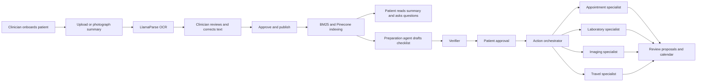

# CareBridge AI Care Companion

CareBridge turns a photographed or uploaded visit summary into a clinician-reviewed record, grounded answers, and an actionable plan for the patient's next visit. It gives patients, authorized care partners, and clinicians role-specific experiences through one responsive application.

This repository contains the Team 42 hackathon implementation. Use fictional patient data in this environment. The current role selector supports the demonstration flow and is not production authentication.

## What CareBridge does

- Clinicians onboard patients and receive an automatically generated patient ID.
- Clinicians photograph or upload a visit summary for LlamaParse OCR.
- The original document and plain-text transcription appear side by side for correction and approval.
- Approved summaries are indexed with SQLite FTS5 BM25 and, when configured, OpenAI embeddings and Pinecone.
- Patients and authorized care partners can ask grounded questions across all approved visits or select a specific older visit.
- The preparation agent identifies explicit appointments, laboratory work, imaging, and other documented next steps.
- A verifier checks the preparation plan before the patient reviews and approves it.
- A LangGraph orchestrator routes approved actions to appointment, laboratory, imaging, and travel specialists.
- Patients review exact proposals before confirmation and can download confirmed actions as an iCalendar file.
- Care-partner access, reminders, corrections, approvals, cancellations, and workflow activity are persisted in SQLite.
- LangSmith provides privacy-preserving traces, and the evaluation suite includes deterministic checks with optional RAGAS scoring.

## User flow



## Technology

| Layer                 | Technology                     |
| --------------------- | ------------------------------ |
| Web application       | React, TypeScript, Vite        |
| API and persistence   | Python, FastAPI, SQLite        |
| Agent workflows       | LangGraph                      |
| OCR                   | LlamaParse through LlamaIndex  |
| Models and embeddings | OpenAI                         |
| Retrieval             | SQLite FTS5 BM25 and Pinecone  |
| Tracing               | LangSmith                      |
| Evaluation            | Deterministic suites and RAGAS |

## Repository structure

```text
gbmcarepartner/
├── backend/
│   ├── app/                 FastAPI, agents, retrieval, OCR and tracing
│   ├── evals/               Versioned evaluation datasets
│   ├── tests/               Backend and workflow tests
│   └── requirements.txt
├── frontend/
│   ├── src/                 React application
│   └── tests/               Playwright tests
├── GBM_AI_Care_Companion_PRD.md
├── GBM_AI_Care_Companion_Architecture_Diagrams.md
└── GBM_CareBridge_Implementation_Plan.md
```

## Prerequisites

- Python 3.11 or newer
- Node.js 20.12 or newer
- npm
- A LlamaCloud API key for OCR
- An OpenAI API key for grounded answers, preparation generation, verification, embeddings, and optional RAGAS scoring
- Pinecone and LangSmith accounts only when their optional integrations are enabled

## Configure the backend

From the `gbmcarepartner` directory:

```bash
python3 -m venv .venv
source .venv/bin/activate
python -m pip install -r backend/requirements.txt
cp backend/.env.example backend/.env
```

Set at least these values in `backend/.env` for the complete document and agent flow:

```env
LLAMA_CLOUD_API_KEY=your-llamacloud-key
OPENAI_API_KEY=your-openai-key
```

The application always provides local BM25 search. To enable hybrid semantic retrieval, also configure:

```env
PINECONE_API_KEY=your-pinecone-key
PINECONE_INDEX_HOST=your-index-host
OPENAI_EMBEDDING_DIMENSIONS=1536
```

The Pinecone index dimension must match `OPENAI_EMBEDDING_DIMENSIONS`.

To enable LangSmith tracing:

```env
LANGSMITH_TRACING=true
LANGSMITH_API_KEY=your-langsmith-key
LANGSMITH_PROJECT=carebridge-development
LANGSMITH_HIDE_INPUTS=true
LANGSMITH_HIDE_OUTPUTS=true
```

CareBridge traces OCR, grounded answering, preparation planning, and action orchestration. Trace metadata excludes document text, questions, answers, uploaded bytes, names, contact details, and patient identifiers.

## Run locally

Start the backend from one terminal:

```bash
cd backend
python -m uvicorn app.main:app --reload
```

The API runs at `http://127.0.0.1:8000`. Interactive API documentation is available at `http://127.0.0.1:8000/docs`.

Start the frontend from another terminal:

```bash
cd frontend
npm ci
npm run dev
```

Open `http://127.0.0.1:5173`.

## Demonstration sequence

1. Enter as **Clinician** and onboard a patient.
2. Copy the generated patient ID.
3. Upload or photograph a fictional visit summary.
4. Compare the source and extracted text, save corrections, approve, and publish it.
5. Enter as **Patient** using the generated patient ID.
6. Open the approved summary and ask a question. Select a specific visit to ask about an older summary.
7. Open **Visit preparation** and generate the preparation checklist.
8. Approve the checklist and review the resulting appointment, laboratory, imaging, or travel arrangements.
9. Add a care partner under **People & permissions** if desired.
10. Inspect workflow activity and LangSmith traces.

Only approved and successfully indexed summary versions are visible to patients or available to retrieval and preparation agents.

## Validation

Run backend tests:

```bash
cd backend
python -m unittest discover -s tests -q
```

Run frontend checks:

```bash
cd frontend
npm run build
npm run format:check
npx playwright install chromium
npm run test:e2e
```

The clinician-only evaluation endpoints and evaluation screen execute grounded-answer and preparation/action cases. RAGAS model scoring is optional; authorization, routing, citation, abstention, prerequisite, and idempotency checks remain deterministic.

## Data and integration boundaries

SQLite stores local application state in `backend/carebridge.db`, and uploaded source files are stored under `backend/storage/`. Both are excluded from Git. Deleting the database resets patients and invalidates patient IDs retained by the browser.

Scheduling, laboratory, imaging, travel, and reminder providers use contained integration adapters for the hackathon. They persist proposals, approvals, state transitions, and receipts without contacting real providers. The application does not diagnose, interpret scans, choose treatment, change medication, or autonomously send clinical instructions.

## Project documents

- [Product requirements](GBM_AI_Care_Companion_PRD.md)
- [Architecture and workflows](GBM_AI_Care_Companion_Architecture_Diagrams.md)
- [Implementation plan](GBM_CareBridge_Implementation_Plan.md)
- [Team 42 breakout handout](Team_42_CareBridge_Breakout_Handout.md)
- [Frontend details](frontend/README.md)
- [Backend details](backend/README.md)
